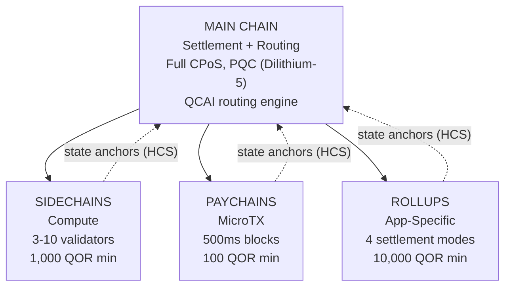

# Çok Katmanlı Mimari

QoreChain, `x/multilayer` modülü aracılığıyla **4 katmanlı hiyerarşik bir zincir mimarisi** uygular. Ana zincir, uzlaşma (settlement) ve güven kökü olarak hizmet ederken, yardımcı katmanlar (yan zincirler, ödeme zincirleri ve rollup'lar) farklı performans ve güvenlik ödünleşimleriyle uzmanlaşmış iş yüklerini ele alır.

---

## Sistem Genel Bakışı

Aşağıdaki 4 katmanlı hiyerarşi, ana zinciri uzlaşma ve güven kökü olarak gösterir; üç yardımcı katman türü, durum köklerini Hiyerarşik Taahhüt Şemaları (Hierarchical Commitment Schemes, HCS) aracılığıyla ona geri bağlar.



```
                    +---------------------------+
                    |       MAIN CHAIN          |
                    |  (Settlement + Routing)   |
                    |  Full CPoS consensus      |
                    |  PQC-secured (Dilithium-5)|
                    |  QCAI routing engine       |
                    +------+------+------+------+
                           |      |      |
              +------------+      |      +------------+
              |                   |                    |
    +---------v--------+ +-------v--------+ +---------v---------+
    |   SIDECHAINS     | |   PAYCHAINS    | |     ROLLUPS       |
    |  (Compute)       | |  (MicroTX)     | |  (App-Specific)   |
    |  3-10 validators | |  500ms blocks  | |  4 settlement     |
    |  1,000 QOR min   | |  100 QOR min   | |    modes          |
    |  Max: 10         | |  Max: 50       | |  10,000 QOR min   |
    +------------------+ +----------------+ |  Max: 100         |
                                            +-------------------+
```

---

## Katman Türleri

### Ana Zincir

Ana zincir, tüm QoreChain ekosistemi için güven köküdür.

| Özellik    | Değer                                                                          |
| ---------- | ------------------------------------------------------------------------------ |
| Konsensüs  | Tam Üçlü Havuz CPoS (bkz. [Konsensüs Mekanizması](/architecture/consensus-mechanism)) |
| Güvenlik   | Dilithium-5 imzalarıyla PQC korumalı                                           |
| Rol        | Uzlaşma katmanı, durum çapası depolama, QCAI yönlendirme motoru, güven kökü    |
| Blok süresi | \~5 saniye                                                                    |

Tüm yardımcı katmanlar, durum köklerini Hiyerarşik Taahhüt Şemaları (HCS) aracılığıyla periyodik olarak ana zincire bağlar.

### Yan Zincirler (Sidechains)

Yan zincirler, DeFi protokolleri, oyun motorları ve IoT veri işleme gibi **hesaplama yoğun işlemleri** ele alır.

| Parametre                 | Değer             |
| ------------------------- | ----------------- |
| Asgari doğrulayıcı        | 3                 |
| Azami doğrulayıcı         | 10                |
| Asgari kurucu hisse       | 1,000 QOR         |
| Azami aktif yan zincir    | 10                |
| Hedef alanlar             | DeFi, Gaming, IoT |

### Ödeme Zincirleri (Paychains)

Ödeme zincirleri, asgari gecikmeyle **yüksek frekanslı mikro işlemler** için optimize edilmiştir.

| Parametre                | Değer                                   |
| ------------------------ | --------------------------------------- |
| Hedef blok süresi        | 500 ms                                  |
| Azami aktif ödeme zinciri | 50                                     |
| Asgari kurucu hisse      | 100 QOR                                 |
| Hedef alanlar            | Payments, streaming, micro-transactions |

### Rollup'lar

Rollup'lar, Rollup Geliştirme Kiti (Rollup Development Kit, `x/rdk`) aracılığıyla dağıtılan **uygulamaya özel zincirlerdir**. Çok katmanlı modül içinde bir rollup katman türü olarak kaydedilirler.

| Parametre              | Değer                                       |
| ---------------------- | ------------------------------------------- |
| Uzlaşma modları        | 4 (optimistic, zk, based, sovereign)        |
| Azami aktif rollup     | 100                                         |
| Asgari kurucu hisse    | 10,000 QOR                                  |
| Katman türü            | `rollup`                                    |
| Hedef alanlar          | DeFi, Gaming, NFT, Enterprise               |

Rollup dağıtımı ve yapılandırması, [Rollup Geliştirme Kiti](/architecture/rollup-development-kit) bölümünde ayrıntılı olarak ele alınmıştır.

---

## QCAI İşlem Yönlendirmesi

QCAI yönlendiricisi, gelen her işlem için tüm aktif katmanları değerlendirir ve 4 faktörlü ağırlıklı bir puanlama modeli kullanarak en uygun hedefi seçer.

### Puanlama Formülü

Her aday katman bir bileşik puan alır (daha yüksek daha iyidir):

```
Score = w_congestion * (1 - Congestion) + w_capability * Capability + w_cost * (1 - Cost) + w_latency * (1 - Latency)
```

| Faktör     | Ağırlık | Açıklama                                                                     |
| ---------- | ------- | --------------------------------------------------------------------------- |
| Congestion | 0.30    | Mevcut yük seviyesi (ters: düşük tıkanıklık = yüksek puan)                   |
| Capability | 0.40    | Katmanın işlem gereksinimleriyle ne kadar iyi eşleştiği                      |
| Cost       | 0.20    | Ana zincire göre ücret çarpanı (ters: düşük maliyet = yüksek puan)           |
| Latency    | 0.10    | Kesinliğe (finality) kadar beklenen süre (ters: düşük gecikme = yüksek puan) |

### Güven Eşiği

Yönlendirici, bir işlemi bir yardımcı katmana yönlendirmeden önce **0.6** asgari güven puanı gerektirir. Hiçbir katman bu eşiği karşılamazsa, işlem varsayılan olarak ana zincire gider.

İşlem göndereni tarafından tercih edilen bir katman ipucu sağlanabilir. Tercih edilen katman, güven eşiğinin en az %80'ini (yani 0.48) puanlarsa, yönlendirme hedefi olarak kabul edilir.

### Yük Sezgileri

Ayrıntılı işlem meta verisi mevcut olmadığında, yönlendirici yük boyutunu bir sınıflandırma sinyali olarak kullanır:

| Yük Boyutu        | Tercih Edilen Katman | Gerekçe                                      |
| ----------------- | -------------------- | -------------------------------------------- |
| &lt; 256 bayt     | Paychain             | Muhtemelen basit bir transfer veya mikro işlem |
| 256 - 1,024 bayt  | Main Chain           | Standart işlem karmaşıklığı                  |
| > 1,024 bayt      | Sidechain            | Muhtemelen karmaşık bir sözleşme etkileşimi  |

---

## Hiyerarşik Taahhüt Şemaları (HCS)

Yardımcı katmanlar, durumlarını **durum çapaları (state anchors)** aracılığıyla periyodik olarak ana zincire taahhüt eder. Her çapa, yardımcı zincirin belirli bir yükseklikteki durumunun kriptografik bir kanıtını içerir.

### Çapa İçeriği

| Alan                      | Açıklama                                             |
| ------------------------- | ---------------------------------------------------- |
| `layer_id`                | Yardımcı katmanın tanımlayıcısı                      |
| `layer_height`            | Yardımcı zincirdeki blok yüksekliği                  |
| `state_root`              | Yardımcı zincirin durum ağacının Merkle kökü         |
| `validator_set_hash`      | Taahhüdü imzalayan doğrulayıcı kümesinin hash'i      |
| `pqc_aggregate_signature` | Çapa verisi üzerindeki Dilithium-5 toplu imza        |
| `transaction_count`       | Son çapadan bu yana işlem sayısı                     |
| `compressed_state_proof`  | Sıkıştırılmış durum geçiş kanıtı                     |

### Çapa Gönderimi

Çapalar, `MsgAnchorState` aracılığıyla ana zincire gönderilir. Keeper, çapayı aşağıdaki adımlara göre doğrular:

1. **Katman mevcut ve aktif** — Keeper, katmanın durumda bulunduğunu ve şu anda `active` statüsüne sahip olduğunu doğrular.
2. **Asgari çapa aralığı geçti** — Keeper, bu katman için son çapadan bu yana en az `min_anchor_interval` blok (varsayılan: 100) geçtiğini kontrol eder.
3. **PQC toplu imza** — Keeper, PQC toplu imzanın mevcut olduğundan ve çapa verisi için geçerli olduğundan emin olur.

### İtiraz Süresi

Her çapa, **24 saatlik** bir **itiraz süresine** girer (86,400 saniye, katman başına yapılandırılabilir). Bu süre boyunca, herhangi bir taraf `MsgChallengeAnchor` aracılığıyla bir dolandırıcılık kanıtı (fraud proof) göndererek çapaya itiraz edebilir. Dolandırıcılık kanıtı geçerliyse, çapa geçersiz kılınır ve yardımcı zincirin durumu önceki çapaya geri alınır.

İtiraz süresi başarılı bir itiraz olmadan sona erdiğinde, çapa kesinleşmiş kabul edilir.

---

## Katmanlar Arası Ücret Paketleme (CLFB)

CLFB, kaynak katmanda tek bir ücret ödemesinin katmanlar arası bir işlem yolunda birden çok katmandaki yürütmeyi kapsamasına izin verir.

### Ücret Hesaplama

```
avgMultiplier = sum(layer_multiplier_i) / num_layers
bundledFee = (totalGas / 1000) * avgMultiplier
```

Burada:

* `layer_multiplier_i`, işlem yolundaki her katman için temel ücret çarpanıdır (ana zincir = 1.0).
* `totalGas`, tüm katmanlardaki tahmini toplam gaz tüketimidir.
* Sonuç, asgari 1 uqor ücretiyle **uqor** cinsinden ifade edilir.

### Örnek

Katmanlar arası bir işlem üç katmana dokunur: ana zincir (çarpan 1.0), bir yan zincir (çarpan 0.5) ve bir ödeme zinciri (çarpan 0.1).

```
avgMultiplier = (1.0 + 0.5 + 0.1) / 3 = 0.533
bundledFee = (150,000 / 1000) * 0.533 = 80 uqor
```

CLFB, `cross_layer_fee_bundling` parametresi aracılığıyla küresel olarak etkinleştirilebilir veya devre dışı bırakılabilir ve bireysel katmanlar `cross_layer_fee_bundling_enabled` yapılandırma bayrakları aracılığıyla devre dışı kalmayı seçebilir.

---

## Katman Yaşam Döngüsü

Her yardımcı katman, iyi tanımlanmış bir yaşam döngüsünden geçer:

```
Proposed --> Active --> Suspended --> Decommissioned
                  \                /
                   +-- Active <--+
```

| Statü              | Açıklama                                                                         | İzin Verilen Geçişler     |
| ------------------ | ------------------------------------------------------------------------------- | ------------------------- |
| **Proposed**       | Katman kaydedilmiş ancak henüz etkinleştirilmemiş                                | Active, Decommissioned    |
| **Active**         | Katman işlevsel ve işlem kabul ediyor                                            | Suspended, Decommissioned |
| **Suspended**      | Katman geçici olarak duraklatıldı (örneğin bakım için veya güvenlik endişeleri nedeniyle) | Active, Decommissioned |
| **Decommissioned** | Katman kalıcı olarak kapatıldı (son durum)                                       | Yok                       |

Statü geçişleri keeper tarafından uygulanır. Geçersiz geçişler (örneğin Decommissioned'dan Active'e) reddedilir.

---

## Parametreler

| Parametre                      | Tür    | Varsayılan      | Açıklama                                                |
| ------------------------------ | ------ | --------------- | ------------------------------------------------------- |
| `max_sidechains`               | uint64 | `10`            | Azami aktif yan zincir sayısı                           |
| `max_paychains`                | uint64 | `50`            | Azami aktif ödeme zinciri sayısı                        |
| `min_anchor_interval`          | uint64 | `100`           | Durum çapaları arasındaki asgari blok                   |
| `max_anchor_interval`          | uint64 | `1,000`         | Durum çapaları arasındaki azami blok (zorunlu çapa)     |
| `default_challenge_period`     | uint64 | `86,400`        | Saniye cinsinden varsayılan itiraz süresi (24 saat)     |
| `min_sidechain_stake`          | string | `1,000,000,000` | Bir yan zincir oluşturmak için asgari hisse (uqor cinsinden 1,000 QOR) |
| `min_paychain_stake`           | string | `100,000,000`   | Bir ödeme zinciri oluşturmak için asgari hisse (uqor cinsinden 100 QOR) |
| `routing_enabled`              | bool   | `true`          | QCAI tabanlı işlem yönlendirmesini etkinleştir          |
| `routing_confidence_threshold` | string | `0.6`           | QCAI yönlendirme kararları için asgari güven            |
| `cross_layer_fee_bundling`     | bool   | `true`          | Küresel Katmanlar Arası Ücret Paketlemeyi etkinleştir   |
