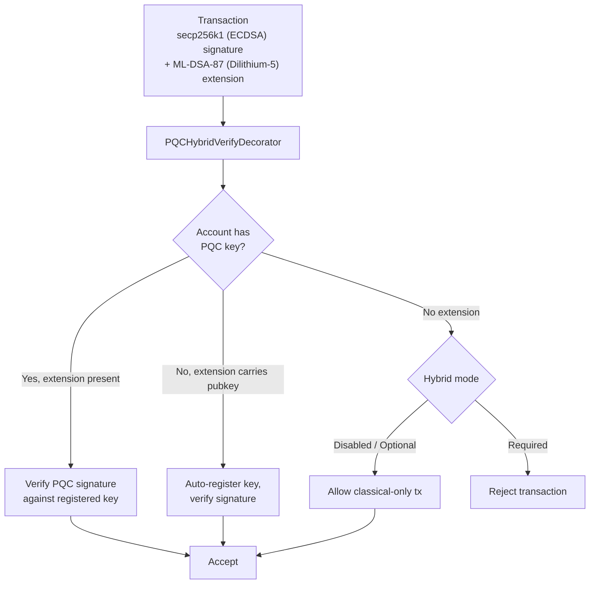

# Kuantum Sonrası Güvenlik

QoreChain, **kuantum sonrası kriptografi (post-quantum cryptography, PQC) ile genesis'te** inşa edilmiştir — sonradan bir yükseltme olarak eklenmemiştir. `x/pqc` modülü, uzun vadeli dayanıklılık için yönetişim kontrollü bir algoritma çevikliği çerçevesiyle birlikte birincil kriptografik ilkeller olarak kafes tabanlı dijital imzalar ve anahtar kapsülleme sağlar.

Tam PQC temeli — **Dilithium-5 (imzalar) + ML-KEM-1024 (KEM) + SHAKE-256 (hash)** — artık tamamlandı ve ağ varsayılanıdır. Mevcut zincir sürümü itibarıyla (**v3.1.82**), hibrit imzalar cosmos işlem yolunda **varsayılan olarak gereklidir**: `hybrid_signature_mode = required` ve `allow_classical_fallback = false`. Her cosmos yolu işlemi, klasik secp256k1 imzasının yanında bir Dilithium-5 imzası taşımalıdır; bir PQC hesabından gelen yalnızca klasik işlemler reddedilir ve klasik geri dönüş (downgrade) yolu kapalıdır.

## Tasarım İlkeleri

* **Varsayılan olarak PQC gerekli**: Cosmos yolunda kuantum sonrası imzalar zorunludur. Tek başına klasik secp256k1 imzaları artık yeterli değildir — `allow_classical_fallback = false`.
* **Varsayılan olarak hibrit**: Cosmos işlemleri aynı anda hem bir klasik secp256k1 imzası hem de bir Dilithium-5 PQC imzası taşır. Yalnızca klasik geri dönüş kapalıdır.
* **Algoritma çevikliği**: Kriptografik algoritma kayıt defteri yönetişim kontrollüdür ve ağın hard fork olmadan yeni algoritmalar benimsemesine veya ele geçirilmiş olanları kullanımdan kaldırmasına olanak tanır.
* **Deterministik doğrulama**: Tüm imza doğrulaması, doğrulayıcı düğümleri genelinde deterministik ve yeniden üretilebilirdir.

## Desteklenen Algoritmalar

| Algoritma       | Standart             | Kategori          | NIST Düzeyi | Genel Anahtar | Özel Anahtar | İmza / Şifreli Metin   | Paylaşılan Sır |
| --------------- | -------------------- | ----------------- | ----------- | ------------- | ------------ | ---------------------- | -------------- |
| **Dilithium-5** | ML-DSA-87 (FIPS 204) | İmza              | 5           | 2,592 bayt    | 4,896 bayt   | 4,627 bayt             | --             |
| **ML-KEM-1024** | FIPS 203             | Anahtar Kapsülleme | 5          | 1,568 bayt    | 3,168 bayt   | 1,568 bayt             | 32 bayt        |

Her iki algoritma da en yüksek standartlaştırılmış güvenlik kategorisi olan **NIST Güvenlik Düzeyi 5'te** çalışır ve hem klasik hem de kuantum rakiplere karşı AES-256'ya eşdeğer koruma sağlar.

## Kriptografik Arka Uç

PQC işlemleri, kafes tabanlı imzalama, doğrulama ve anahtar kapsüllemeyi QoreChain çalışma zamanına sunan yüksek performanslı, bellek güvenli bir kriptografik arka uçta uygulanır. Arka uç şunları sağlar:

Algoritmaya özel işlemler:

* Dilithium-5 anahtar üretimi, imzalama ve doğrulama
* ML-KEM-1024 anahtar üretimi, kapsülleme ve kapsül açma
* Deterministik rastgele işaret üretimi (`seed`, `epoch`)

Algoritmaya duyarlı işlemler:

* `Keygen(algorithmID)` — Kayıtlı herhangi bir algoritma için bir anahtar çifti üret
* `Sign(algorithmID, privkey, message)` — Bir imza oluştur
* `Verify(algorithmID, pubkey, message, signature)` — Bir imzayı doğrula
* `AlgorithmInfo(algorithmID)` — Anahtar/çıktı boyutlarını sorgula
* `ListAlgorithms()` — Desteklenen tüm algoritmaları listele

Tüm imzalama ve doğrulama işlemleri deterministiktir ve her doğrulayıcı düğümünde ve desteklenen platformda aynı sonuçları üretir.

Bu aynı ilkeller — ML-DSA (FIPS-204), ML-KEM (FIPS-203) ve SHAKE-256 (FIPS-202) — altı dilde (JavaScript/TypeScript, Rust, Go, C, Python, Java) tek tutarlı, bayt uyumlu bir API sağlayan açık kaynaklı [**qorechain-pqc**](https://github.com/qorechain/qorechain-pqc) kütüphanesi aracılığıyla cüzdanlar ve entegrasyon yapanlar için kullanılabilir. [Kuantum Sonrası İmzalama](/developer-guide/post-quantum-signing) sayfasına bakın.

## Anahtar Kaydı

Hesaplar, PQC anahtarlarını `MsgRegisterPQCKey` (eski, varsayılan olarak Dilithium-5) veya `MsgRegisterPQCKeyV2` (algoritmaya duyarlı) aracılığıyla kaydeder. Her mesaj şunları içerir:

* **Sender**: Anahtarı kaydeden hesap adresi.
* **PublicKey**: PQC genel anahtar baytları.
* **AlgorithmID**: PQC algoritma tanımlayıcısı (yalnızca v2).
* **KeyType**: Üç kayıt modundan biri:

| Anahtar Türü     | Açıklama                                                                 |
| ---------------- | ------------------------------------------------------------------------ |
| `hybrid`         | Hem klasik (ECDSA) hem de PQC anahtarları. İşlemler çift imza taşır.     |
| `pqc_only`       | Yalnızca PQC anahtarı. Klasik imza gerekli değildir.                     |
| `classical_only` | Yalnızca klasik anahtar. PQC koruması yok (önerilmez).                   |

## Hibrit İmzalar

Hibrit imza sistemi, cosmos yolu işlemlerinin aynı anda **hem** bir klasik imza **hem de** bir PQC imzası taşımasını gerektirir. Bu, derinlemesine savunma sağlar: bir şema kırılsa bile diğeri işlemi korur.

`hybrid_signature_mode = required` ağ varsayılanıyla, her cosmos yolu işlemi secp256k1 imzasının yanında Dilithium-5 uzantısını içermelidir. Tek istisnalar (önyükleme için) **genesis gentx'leri (yükseklik 0)** ve hesapların ilk PQC anahtarlarını kaydedebilmesi için yalnızca klasik olmalarına izin verilen **PQC anahtar kaydı/geçiş işlemleridir** (`MsgRegisterPQCKey`, `MsgRegisterPQCKeyV2`, `MsgMigratePQCKey`).

**EVM işlemleri etkilenmez.** EVM işlemleri ayrı bir `eth_secp256k1` ante yolunda (QoreChain EVM Motoru yolu) kimlik doğrulaması yapılır ve asla hibrit PQC uzantısı gerektirmez. Hibrit gereksinimi yalnızca cosmos işlem yoluna uygulanır.

### Eş İmzalama Akışı

Uyumlu bir cosmos işlemi üretmek için, klasik secp256k1 imzası standart imza baytları üzerinden hesaplanır (bunlar PQC uzantısını hariç tutar) ve bir Dilithium-5 imzası hesaplanarak `PQCHybridSignature` uzantısı olarak eklenir. Standart CosmJS / aktarıcı araçları, cosmos yolunda işlem yapmak için bu uzantıyı üretmelidir. Bugün bu şu şekilde yapılır:

* `qorechaind tx pqc gen-key` — bir Dilithium-5 anahtarı üret.
* `qorechaind tx pqc cosign` — bir işleme Dilithium-5 eş imzasını ekle.
* QoreChain SDK'sının hibrit imzalaması — `includePqcPublicKey` ile `buildHybridTx` (ilk kullanımda otomatik kayıt için PQC genel anahtarını gömer).

*secp256k1 (ECDSA) artı ML-DSA-87 (Dilithium-5) ile imzalanmış, zincir genelinde uygulama modu altında ante işleyici tarafından doğrulanan bir işlem.*



### TX Uzantı Formatı

PQC imzaları, işlemlere `/qorechain.pqc.v1.PQCHybridSignature` tür URL'sine sahip bir **TX uzantısı** olarak eklenir:

```text
{
  "algorithm_id": 1,
  "pqc_signature": "<4627 bytes for Dilithium-5>",
  "pqc_public_key": "<2592 bytes, optional>"
}
```

`pqc_public_key` alanı isteğe bağlıdır. Mevcutsa ve hesabın kayıtlı bir PQC anahtarı yoksa, ante işleyici anahtarı ilk kullanımda **otomatik kaydeder**.

### PQCHybridVerifyDecorator

`PQCHybridVerifyDecorator` ante işleyicisi, hibrit imzaları üç yönlü doğrulama mantığıyla işler:

| Senaryo  | Hesabın PQC Anahtarı Var | Uzantı Mevcut | Uzantıda Genel Anahtar | Sonuç                                                |
| -------- | ------------------------ | ------------- | ---------------------- | --------------------------------------------------- |
| Yol 1    | Evet                     | Evet          | --                     | PQC imzasını kayıtlı anahtara karşı doğrula          |
| Yol 2    | Hayır                    | Evet          | Evet                   | Anahtarı otomatik kaydet, imzayı doğrula             |
| Yol 3a   | Hayır                    | Hayır         | --                     | **Optional modu**: Yalnızca klasik işleme izin ver  |
| Yol 3b   | Hayır                    | Hayır         | --                     | **Required modu**: İşlemi reddet                     |
| Yol 4    | Evet                     | Hayır         | --                     | Standart PQCVerifyDecorator tarafından işlenir       |

### Hibrit İmza Modları

Zincir genelindeki hibrit uygulama düzeyi yönetişimle yapılandırılabilir. **Mevcut ağ varsayılanı `required`'dır**:

| Mod          | ID | Varsayılan | Davranış                                                                                                          |
| ------------ | -- | ---------- | ----------------------------------------------------------------------------------------------------------------- |
| **Disabled** | 0  | Hayır      | Yalnızca klasik imzalar. PQC uzantıları yok sayılır.                                                              |
| **Optional** | 1  | Hayır      | PQC uzantıları mevcutsa doğrulanır. PQC anahtarı olmayan hesaplar yalnızca klasik imzalarla işlem yapabilir.     |
| **Required** | 2  | **Evet**   | Tüm cosmos yolu işlemleri hem klasik hem de PQC imzaları taşımalıdır. PQC uzantısı olmayan işlemler reddedilir.   |

Ağ geçişini tamamladı: **Optional** (genesis) → **Required** (v3.1.71'den bu yana mevcut varsayılan, `allow_classical_fallback = false` ile). Üç mod yönetişim kontrollü kalır ve öneriyle ayarlanabilir.

## Algoritma Çevikliği Çerçevesi

Algoritma çevikliği çerçevesi, PQC algoritmaları için yönetişim kontrollü bir kayıt defteri sağlar ve ağın yeni algoritmalar eklemesine, savunmasız olanları kullanımdan kaldırmasına ve hesapları geçirmesine olanak tanır — hepsi hard fork olmadan.

### Algoritma Yaşam Döngüsü

Kayıtlı her algoritmanın bir yaşam döngüsü statüsü vardır:

```
active --> migrating --> deprecated --> disabled
```

| Statü          | Açıklama                                                                                                                                    |
| -------------- | ------------------------------------------------------------------------------------------------------------------------------------------- |
| **Active**     | Tamamen işlevsel. Yeni anahtar kayıtları ve doğrulamaları kabul edilir.                                                                     |
| **Migrating**  | Çift imza süresi aktiftir. Hesaplar, yedek algoritmaya geçmeye teşvik edilir. Hem eski hem de yeni imzalar kabul edilir.                    |
| **Deprecated** | Mevcut imzalar hâlâ doğrulanabilir, ancak yeni anahtar kayıtları kabul edilmez.                                                             |
| **Disabled**   | Acil durum kapatma anahtarı. Algoritma hiçbir imzayı doğrulayamaz. Bir güvenlik açığı keşfedildiğinde kullanılır.                           |

### Çift İmza Geçişi

Bir algoritma kullanımdan kaldırıldığında, bir **geçiş süresi** başlar (varsayılan: 1,000,000 blok, 6s/blokta yaklaşık 69 gün). Bu süre boyunca:

1. Kullanımdan kaldırılan algoritmayı kullanan anahtarlara sahip hesaplar, yedeğe geçmelidir.
2. Geçiş, çift imza gerektirir (`MsgMigratePQCKey`): biri eski anahtardan, biri yeni anahtardan, her ikisinin de sahipliğini kanıtlar.
3. Geçiş süresi boyunca her iki algoritma da doğrulama için kabul edilir.

### Yönetişim Mesajları

| Mesaj                   | Açıklama                                                                                                                                                          |
| ----------------------- | ----------------------------------------------------------------------------------------------------------------------------------------------------------------- |
| `MsgAddAlgorithm`       | Kayıt defterine yeni bir PQC algoritması eklemeyi önerir. Tam `AlgorithmInfo` (ad, kategori, NIST düzeyi, anahtar boyutları) içerir. Yönetişim aracılığıyla gönderilmelidir. |
| `MsgDeprecateAlgorithm` | Bir algoritma için kullanımdan kaldırma sürecini başlatır. Yedek algoritmayı ve blok cinsinden geçiş süresini belirtir.                                          |
| `MsgDisableAlgorithm`   | Bir algoritmayı hemen acil olarak devre dışı bırakır. Bir gerekçe dizesi gerektirir. Bir kriptografik güvenlik açığı keşfedildiğinde kullanılır.                  |

### Genişletilebilirlik

Yeni bir algoritma eklemek şunları gerektirir:

1. Algoritmayı, birleşik imzalama ve doğrulama arayüzü arkasındaki kriptografik arka uçta uygulamak.
2. Algoritma meta verisiyle bir `MsgAddAlgorithm` yönetişim önerisi göndermek.
3. Onaylandığında, algoritma anahtar kaydı ve doğrulama için kullanılabilir hale gelir.

## SHAKE-256 Hash

v3.1.73 itibarıyla, **SHAKE-256** (SHA-3 genişletilebilir çıktı fonksiyonu), `qorehash` paketi tarafından sağlanan, QoreChain genelinde **varsayılan uygulama hash'idir** — Dilithium-5 imzaları ve ML-KEM-1024 anahtar kapsüllemenin yanında kuantuma dayanıklı kriptografik temeli tamamlar. `x/pqc` modülü saf Go SHAKE-256 yardımcı programları sağlar:

| Fonksiyon                          | Açıklama                          | Çıktı            |
| ---------------------------------- | --------------------------------- | ---------------- |
| `SHAKE256Hash(data, outputLen)`    | Değişken uzunlukta SHAKE-256 özeti | Rastgele uzunluk |
| `SHAKE256Hash32(data)`             | Standart 256 bitlik SHAKE-256 özeti | 32 bayt        |
| `SHAKE256ConcatHash(left, right)`  | Birleştirilmiş girdilerin hash'i  | 32 bayt          |
| `SHAKE256DomainHash(domain, data)` | Alan ayrımlı hash                 | 32 bayt          |

Bu yardımcı programlar, varsayılan uygulama hash'ini destekler ve şunlar için kullanılır:

* Merkle ağacı düğümü hash'leme
* Katmanlar arası kanıtlamalarda hash taahhütleri
* Farklı hash bağlamları için alan ayrımı (örneğin, `"leaf:"` ile `"node:"` karşılaştırması)

## Köprü PQC

Tüm çapraz zincir köprü kanıtlamaları ve durum taahhütleri **Dilithium-5** imzaları kullanır. `x/multilayer` modülü, her `MsgAnchorState` gönderiminde PQC toplu imzalar gerektirir ve ML-KEM taahhütleri, köprü aktarıcıları arasındaki anahtar değişim kanallarını güvence altına alır.

Bu, köprü altyapısında klasik kriptografi kullanımıyla çapraz zincir güvenliğinin bozulmamasını sağlayarak protokol yığını genelinde kuantum direncini korur.

## Modül Parametreleri

| Parametre                  | Tür                 | Varsayılan        | Açıklama                                              |
| -------------------------- | ------------------- | ----------------- | ----------------------------------------------------- |
| `pqc_primary`              | bool                | `true`            | PQC, birincil imza şemasıdır                          |
| `allow_classical_fallback` | bool                | `false`           | Yalnızca klasik geri dönüş kapalıdır; cosmos işlemleri hibrit olmalıdır |
| `min_security_level`       | int32               | `5`               | Kabul edilen algoritmalar için asgari NIST güvenlik düzeyi |
| `default_migration_blocks` | int64               | `1,000,000`       | Blok cinsinden varsayılan çift imza geçiş süresi      |
| `default_signature_algo`   | AlgorithmID         | `1` (Dilithium-5) | Yeni anahtar kayıtları için varsayılan imza algoritması |
| `hybrid_signature_mode`    | HybridSignatureMode | `2` (Required)    | Zincir genelinde hibrit imza uygulama düzeyi          |

## İlgili

* [Kuantum Sonrası İmzalama](/developer-guide/post-quantum-signing) — bu ilkeller ve hibrit imzalama için açık kaynaklı `qorechain-pqc` kütüphanesi (altı dil).
* [Cüzdan Kurulumu](/getting-started/wallet-setup) — PQC destekli hesaplar oluşturun ve yönetin.
* [SDK Hesapları ve PQC imzalaması](/sdk/concepts/accounts-pqc) — koddan anahtarlar ve kuantum sonrası imzalama.
* [Zincir Parametreleri](/appendix/chain-parameters) — varsayılan algoritmalar ve geçiş ayarları.
* [Köprü Mimarisi](/architecture/bridge-architecture) — çapraz zincir paketlerinde PQC doğrulaması.
