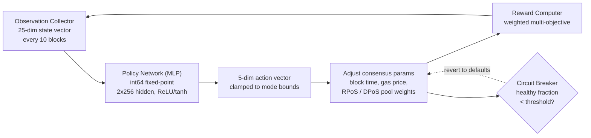

# PRISM Konsensüs Motoru

QoreChain, bir pekiştirmeli öğrenme optimizasyon katmanı olan **PRISM'i** (Policy-driven Reinforcement-learning for Intelligent State Machines), `x/rlconsensus` modülü aracılığıyla doğrudan konsensüs katmanına gömer. PRISM, her N blokta bir zincir metriklerini gözlemler, sabit noktalı bir sinir ağı üzerinden çıkarım çalıştırır ve konsensüs parametresi ayarlamaları önerir — hepsi deterministik olarak, konsensüs açısından kritik yollarda kayan nokta aritmetiği kullanmadan.

*PRISM optimizasyon döngüsü: zincir durumunu gözlemle, politika çıkarımı çalıştır, parametre değişikliklerini sıkıştır ve uygula, ardından sonucu geri besle.*



---

## Mimari Genel Bakış

PRISM dört bileşenden oluşur:

1. **Gözlem Toplayıcı (Observation Collector)** — Yapılandırılabilir aralıklarla 25 boyutlu zincir durumu vektörleri toplar.
2. **Politika Ağı (MLP)** — Gözlemleri eylemlere eşleyen Go-native çok katmanlı bir algılayıcı (perceptron).
3. **Ödül Hesaplayıcı (Reward Computer)** — Parametre değişikliklerinin kalitesini ağırlıklı çok amaçlı bir fonksiyon kullanarak değerlendirir.
4. **Devre Kesici (Circuit Breaker)** — Zincir sağlığını izler ve kararsızlık tespit edilirse tüm PRISM ayarlı parametreleri geri alır.

Tüm bileşenler ABCI yaşam döngüsü içinde çalışır ve tüm doğrulayıcı düğümleri genelinde deterministik, doğrulanabilir çıktılar üretir.

---

## Politika Ağı

Politika ağı, tamamen Go ile **int64 sabit noktalı aritmetik** (10^8 ile ölçeklenmiş) kullanılarak uygulanan ileri beslemeli çok katmanlı bir algılayıcıdır (MLP).

### Ağ Mimarisi

| Özellik             | Değer                              |
| ------------------- | ---------------------------------- |
| Girdi boyutları     | 25                                 |
| Gizli katmanlar     | 2                                  |
| Gizli katman boyutları | 256, 256                        |
| Çıktı boyutları     | 5                                  |
| Aktivasyon (gizli)  | ReLU                               |
| Aktivasyon (çıktı)  | tanh                               |
| Toplam parametre    | 73,733                             |
| Hassasiyet          | int64 sabit noktalı (10^8 ile ölçeklenmiş) |

### Parametre Sayısı Dökümü

```
Layer 1: 25 * 256 + 256   =  6,656  (input -> hidden_1)
Layer 2: 256 * 256 + 256   = 65,792  (hidden_1 -> hidden_2)
Layer 3: 256 * 5 + 5       =  1,285  (hidden_2 -> output)
Total:                       73,733
```

### Sabit Noktalı Aritmetik

Tüm MLP hesaplamaları, `FixedPointScale = 10^8` ile ölçeklenmiş `int64` değerleri kullanır. Bu, donanım platformları genelinde IEEE 754 kayan nokta yuvarlama farklarından kaynaklanan determinizm dışılığı ortadan kaldırır.

* **Çarpma**: `fixMul(a, b) = (a / SCALE) * b + (a % SCALE) * b / SCALE` (taşmayı önlemek için bölünmüş)
* **ReLU**: `relu(x) = max(0, x)`
* **tanh**: `|x| <= 2.5*SCALE` için Padé yaklaşımı `tanh(x) ~ x * (3*S - x^2) / (3*S + x^2)`, aksi halde +/- SCALE'e sıkıştırılır

Politika ağırlıkları, zincir üzerinde düzleştirilmiş bir `[]int64` vektörü olarak saklanır ve yönetişim önerisi aracılığıyla güncellenebilir.

---

## Gözlem Vektörü

PRISM, her gözlem aralığında (varsayılan: her 10 blokta bir) 25 boyutlu bir gözlem vektörü toplar.

| İndeks | Boyut                  | Açıklama                                          |
| ------ | ---------------------- | ------------------------------------------------ |
| 0      | `block_utilization`    | Kullanılan blok gazı / blok gaz limiti           |
| 1      | `tx_count`             | Bloktaki işlem sayısı                            |
| 2      | `avg_tx_size`          | Bayt cinsinden ortalama işlem boyutu             |
| 3      | `block_time`           | Önceki bloktan bu yana geçen süre (ms)           |
| 4      | `block_time_delta`     | Blok süresi eksi hedef blok süresi (ms)          |
| 5      | `gas_price_50th`       | Medyan gaz fiyatı                                |
| 6      | `gas_price_95th`       | 95. yüzdelik dilim gaz fiyatı                    |
| 7      | `mempool_size`         | Bekleyen işlem sayısı                            |
| 8      | `mempool_bytes`        | Bekleyen işlemlerin toplam baytı                 |
| 9      | `validator_count`      | Aktif doğrulayıcı sayısı                         |
| 10     | `validator_gini`       | Doğrulayıcı güç dağılımının Gini katsayısı       |
| 11     | `missed_block_ratio`   | İmzayı kaçıran doğrulayıcıların oranı            |
| 12     | `avg_commit_latency`   | Ortalama commit turu gecikmesi (ms)              |
| 13     | `max_commit_latency`   | Azami commit turu gecikmesi (ms)                 |
| 14     | `precommit_ratio`      | Alınan precommit'lerin oranı                     |
| 15     | `failed_tx_ratio`      | Başarısız işlemlerin oranı                       |
| 16     | `avg_gas_per_tx`       | İşlem başına ortalama tüketilen gaz              |
| 17     | `reward_per_validator` | Doğrulayıcı başına ortalama ödül (uqor)          |
| 18     | `slash_count`          | Gözlem penceresindeki kesme olaylarının sayısı   |
| 19     | `jail_count`           | Gözlem penceresindeki hapis olaylarının sayısı   |
| 20     | `inflation_rate`       | Mevcut emisyon oranı                             |
| 21     | `bonded_ratio`         | Bağlanmış token'lar / toplam arz                 |
| 22     | `reputation_mean`      | Aktif doğrulayıcılar genelinde ortalama itibar puanı |
| 23     | `reputation_stddev`    | İtibar puanlarının standart sapması              |
| 24     | `mev_estimate`         | Tahmini çıkarılan MEV (sezgisel)                 |

Tüm değerler `LegacyDec` dize gösterimleri olarak saklanır ve çıkarımdan önce int64 sabit noktaya dönüştürülür.

---

## Eylem Uzayı

MLP çıktısı, her boyutun bir konsensüs parametresine önerilen bir değişikliği temsil ettiği 5 boyutlu bir eylem vektörüdür. tanh aktivasyonu, ham çıktıları \[-1, 1] aralığına kısıtlar ve bunlar daha sonra moda özel sınırlarla ölçeklenir.

| İndeks | Eylem Boyutu               | Açıklama                                                                 |
| ------ | -------------------------- | ----------------------------------------------------------------------- |
| 0      | `block_time_delta`         | Hedef blok süresine önerilen değişiklik (ms)                            |
| 1      | `gas_price_delta`          | Temel gaz fiyatına önerilen değişiklik                                  |
| 2      | `validator_set_size_delta` | Hedef doğrulayıcı kümesi boyutuna önerilen değişiklik (yalnızca kaydedilir, uygulanmaz) |
| 3      | `pool_weight_rpos_delta`   | RPoS havuz öncelik ağırlığına önerilen değişiklik                       |
| 4      | `pool_weight_dpos_delta`   | DPoS havuz öncelik ağırlığına önerilen değişiklik                       |

Eylemler, uygulamadan önce mevcut PRISM modu tarafından tanımlanan azami değişiklik sınırlarına **sıkıştırılır**.

---

## Ödül Fonksiyonu

Ödül sinyali, son parametre değişikliklerinin zincir performansını ne kadar iyi geliştirdiğini değerlendirir. Beş hedefin ağırlıklı toplamı olarak hesaplanır:

```
R = 0.30 * delta_throughput
  + 0.25 * delta_finality
  + 0.20 * delta_decentralization
  - 0.15 * mev_estimate
  - 0.10 * failed_tx_ratio
```

| Bileşen             | Ağırlık | Yön      | Kaynak Metrik                                 |
| ------------------- | ------- | -------- | --------------------------------------------- |
| Verim (Throughput)  | +0.30   | En üst düzeye çıkar | Blok kullanımındaki değişim         |
| Kesinlik (Finality) | +0.25   | En üst düzeye çıkar | Precommit oranındaki değişim         |
| Merkeziyetsizlik    | +0.20   | En üst düzeye çıkar | Doğrulayıcı Gini katsayısındaki negatif değişim |
| MEV                 | -0.15   | En aza indir | Mevcut MEV tahmini                       |
| Başarısız İşlemler  | -0.10   | En aza indir | Mevcut başarısız işlem oranı             |

Ödül ağırlıkları yönetişimle yapılandırılabilir ve toplamı tam olarak 1.0 olmalıdır.

---

## PRISM Modları

PRISM, yönetişim aracılığıyla kontrol edilebilen dört moddan birinde çalışır:

| Mod              | ID | Azami Değişiklik | Davranış                                                                                   |
| ---------------- | -- | ---------------- | ------------------------------------------------------------------------------------------ |
| **Shadow**       | 0  | %0               | Yalnızca önerileri gözlemle ve kaydet. Hiçbir parametre değiştirilmez. Bu varsayılan moddur. |
| **Conservative** | 1  | +/- %10          | Parametre değişikliklerini sıkı sınırlar içinde uygula. İlk canlı dağıtım için uygundur.    |
| **Autonomous**   | 2  | +/- %25          | Parametre değişikliklerini daha geniş sınırlar içinde uygula. Doğrulanmış politikalara sahip olgun ağlar için. |
| **Paused**       | 3  | %0               | PRISM tamamen boştadır. Hiçbir gözlem toplanmaz ve hiçbir çıkarım çalışmaz.                 |

Mod geçişleri bir yönetişim önerisi gerektirir. Önerilen dağıtım yolu: Shadow → Conservative → Autonomous.

---

## Devre Kesici

Devre kesici, zincir sağlığını izleyen ve kararsızlık tespit edilirse tüm PRISM ayarlı parametreleri otomatik olarak geri alan bir güvenlik mekanizmasıdır.

### Tespit Mantığı

Devre kesici, son **50 bloğu** değerlendirir (`circuit_breaker_window` aracılığıyla yapılandırılabilir):

1. **Blok süresi deltalarını hesapla** — Her ardışık blok zaman damgası çifti için blok süresi deltasını hesapla.
2. **Sağlıklı blokları sınıflandır** — Bir blok, deltası pozitif ve hedef blok süresinin 2 katı içindeyse **sağlıklı** kabul edilir.
3. **Sağlıklı oranı hesapla** — **Sağlıklı oran** = sağlıklı bloklar / toplam deltalar olarak hesapla.

### Tetikleme Koşulu

Sağlıklı oran eşiğin (varsayılan: **%50**) altına düşerse, devre kesici tetiklenir.

### Tepki

Tetiklendiğinde, devre kesici:

1. Tüm PRISM tarafından uygulanan parametreleri (blok süresi, gaz fiyatı, havuz ağırlıkları) varsayılan değerlerine **geri alır**.
2. PRISM'i **duraklatır** (`CircuitBreakerActive = true` ayarlar).
3. Taze bir yeniden yüklemeyi zorlamak için bellek içi politikayı **temizler**.
4. Bir `circuit_breaker_triggered` olayı **yayar**.

Sağlıklı oran sonraki değerlendirmelerde eşiğin üzerine çıktığında devre kesici otomatik olarak temizlenir.

---

## Rollup Danışma Fonksiyonları

PRISM, rollup parametre optimizasyonu için danışma fonksiyonları sağlar:

* **`SuggestRollupProfile`** — Mevcut zincir koşullarını analiz eder ve optimal rollup yapılandırma parametrelerini (blok süresi, gaz limiti, uzlaşma sıklığı) önerir.
* **`OptimizeRollupGas`** — Ana zincir tıkanıklık desenlerine dayanarak rollup uzlaşma işlemleri için gaz fiyatlandırma ayarlamaları önerir.

Bu fonksiyonlar yalnızca bilgilendirme amaçlıdır ve zincir durumunu değiştirmez.

---

## Deterministik Matematik Kütüphanesi

Tüm PRISM hesaplamaları, standart kayan nokta matematiğine deterministik alternatifler sağlayan `mathutil` paketini kullanır:

| Fonksiyon                 | Açıklama                    | Yöntem                                                    |
| ------------------------- | --------------------------- | --------------------------------------------------------- |
| `IntegerSqrt(x)`          | Karekök                     | `LegacyDec` üzerinde Newton yöntemi, 100 iterasyonlu yakınsama |
| `TaylorLn1PlusX(x)`       | Doğal logaritma `ln(1+x)`   | Argüman indirgeme + 15 terimli Taylor serisi              |
| `ExpApprox(x)`            | Üstel `e^x`                 | 12 terimli Taylor serisi                                  |
| `SigmoidApprox(x)`        | Sigmoid `1/(1+e^-x)`        | Negatif girdiler için simetri ile `ExpApprox`             |
| `ReputationMultiplier(r)` | \[0,1] aralığını \[0.5,2.0] aralığına eşler | Ölçek ve ofset ile sigmoid                |

Tüm fonksiyonlar `cosmossdk.io/math.LegacyDec` değerleri üzerinde çalışır ve tüm donanım platformları ile Go derleyici sürümleri genelinde aynı sonuçları sağlar.

---

## Parametreler

| Parametre                        | Tür       | Varsayılan   | Açıklama                                             |
| -------------------------------- | --------- | ------------ | ---------------------------------------------------- |
| `enabled`                        | bool      | `true`       | PRISM'i etkinleştir                                  |
| `observation_interval`           | uint64    | `10`         | Gözlem toplamaları arasındaki bloklar               |
| `agent_mode`                     | PrismMode | `0` (Shadow) | Mevcut çalışma modu                                  |
| `max_change_conservative`        | LegacyDec | `0.10`       | Conservative modda azami parametre değişikliği       |
| `max_change_autonomous`          | LegacyDec | `0.25`       | Autonomous modda azami parametre değişikliği         |
| `circuit_breaker_window`         | uint64    | `50`         | Devre kesici tarafından izlenen son blok sayısı     |
| `circuit_breaker_threshold`      | LegacyDec | `0.50`       | Tetiklemeden önce asgari sağlıklı blok oranı        |
| `default_block_time_ms`          | int64     | `5000`       | Varsayılan hedef blok süresi (ms)                   |
| `default_base_gas_price`         | LegacyDec | `100`        | Varsayılan temel gaz fiyatı                          |
| `default_validator_set_size`     | uint64    | `100`        | Varsayılan hedef doğrulayıcı kümesi boyutu          |
| `reward_weight_throughput`       | LegacyDec | `0.30`       | Verim iyileştirmesi için ödül ağırlığı              |
| `reward_weight_finality`         | LegacyDec | `0.25`       | Kesinlik iyileştirmesi için ödül ağırlığı           |
| `reward_weight_decentralization` | LegacyDec | `0.20`       | Merkeziyetsizlik iyileştirmesi için ödül ağırlığı   |
| `reward_weight_mev`              | LegacyDec | `0.15`       | MEV çıkarımı için ceza ağırlığı                     |
| `reward_weight_failed_txs`       | LegacyDec | `0.10`       | Başarısız işlemler için ceza ağırlığı               |

## İlgili

* [Konsensüs Mekanizması](/architecture/consensus-mechanism) — PRISM'in optimize ettiği konsensüs katmanı.
* [Yapay Zeka Motoru](/architecture/ai-engine) — daha geniş zincir üzeri yapay zeka hizmetleri ve uç noktaları.
* [Tokenomik](/architecture/tokenomics) — RL sinyallerinin ödül ve parametre ayarlamalarını nasıl beslediği.
