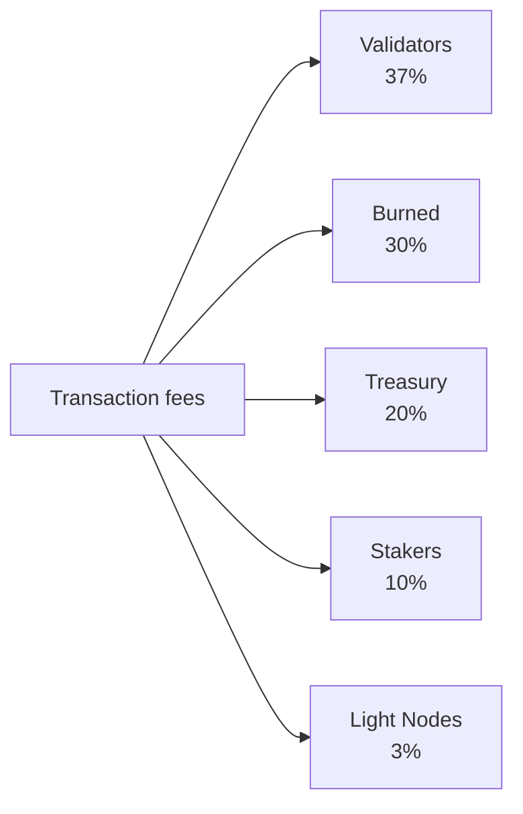

# Tokenomi

QoreChain, yerel **QOR** token'ı etrafında merkezlenen **sabit arzlı** bir ekonomik model kullanır. Ağ, arzı zamanla şişirmek yerine, staking ödüllerini sonlu, önceden ayrılmış bir emisyon bütçesinden finanse ederken, çok kanallı bir yakma motoru ağ kullanımı büyüdükçe sürekli deflasyonist baskı uygular.

---

## Token Temelleri

| Özellik               | Değer                                                    |
| --------------------- | -------------------------------------------------------- |
| **Görünen token**     | QOR                                                      |
| **Temel birim**       | uqor                                                     |
| **Ondalık hassasiyet**| 10^6 (1 QOR = 1.000.000 uqor)                            |
| **Toplam arz**        | 4.500.000.000 QOR (sabit)                                |
| **Zincir Kimliği**    | `qorechain-vladi` (ana ağ, EVM zincir kimliği 9801)     |
| **Bech32 öneki**      | `qor` (hesaplar: `qor1...`, doğrulayıcılar: `qorvaloper...`) |

:::note
Bu sayfadaki rakamlar, 7 Haziran 2026'dan beri zincir sürümü **v3.1.82** üzerinde çalışan **ana ağı** (`qorechain-vladi`, EVM zincir kimliği **9801**) tanımlar. **`qorechain-diana`** test ağı (EVM zincir kimliği **9800**) aynı ekonomik modeli paylaşır.
:::

---

## Arz ve Emisyon Modeli

QoreChain'in **4.500.000.000 QOR'luk sabit toplam arzı** vardır. Arzı şişirmek için asla yeni QOR basılmaz. Bunun yerine:

* **80.000.000 QOR (arzın %1,78'i)** Token Üretim Etkinliği'nde (TGE) yakıldı.
* Staking ödülleri, zaman içinde azalan bir programa göre çekilen **590.000.000 QOR'luk sonlu bir emisyon bütçesinden** ödenir.

Bu, bir arz şişirme modeli değil, **sonlu emisyon bütçeli sabit arzlı bir modeldir**. Emisyon bütçesi tükendiğinde, yönetişimin (governance) kalan bütçeden tahsis ettiği miktarın ötesinde başka bir ödül emisyonu gerçekleşmez.

### Staking Ödül Programı {#staking-reward-schedule}

Staking ödülleri, 590.000.000 QOR'luk emisyon bütçesinden azalan bir programa göre dağıtılır:

| Dönem       | Hedef APY               | Emisyon Bütçesi                  |
| ----------- | ----------------------- | -------------------------------- |
| Yıl 1       | %8–12 APY               | 127.500.000 QOR                  |
| Yıl 2       | %6–10 APY               | 106.250.000 QOR                  |
| Yıl 3–4     | %5–8 APY                | yılda 85.000.000 QOR             |
| Yıl 5+      | Yönetişim tarafından belirlenir | ~186.000.000 QOR kalan       |

APY aralıkları, bağlı (bonded) orana bağlı hedeflerdir; emisyon bütçesi rakamları, her dönemde staking yapanlara serbest bırakılan QOR'un kesin üst sınırlarıdır. 5. Yıldan itibaren, kalan ~186.000.000 QOR yönetişim tarafından belirlenen bir oranda serbest bırakılır.

---

## x/burn — Çok Kanallı Yakma Motoru

`x/burn` modülü, 10 kanallı bir token yakma sistemi uygular. Yakılan her token, dolaşımdaki arzdan kalıcı olarak kaldırılır ve ağ kullanımı büyüdükçe sürekli deflasyonist baskı oluşturur.

### Yakma Kanalları

| #  | Kanal              | Kaynak                     | Açıklama                                       |
| -- | ------------------ | -------------------------- | --------------------------------------------- |
| 1  | `gas_fee`          | İşlem ücretleri            | Tüm gaz ücretlerinin %30'u yakılır            |
| 2  | `contract_create`  | Akıllı sözleşme dağıtımı   | Sözleşme oluşturma başına sabit 100 QOR ücret yakılır |
| 3  | `ai_service`       | AI modülü kullanım ücretleri | AI servis ücretlerinin %50'si yakılır       |
| 4  | `bridge_fee`       | Zincirler arası köprü ücretleri | Köprü ücretlerinin %100'ü yakılır        |
| 5  | `treasury_buyback` | Hazine işlemleri           | Hazineden periyodik geri alım ve yakma        |
| 6  | `failed_tx`        | Başarısız işlem gazı       | Başarısız işlemlerden gelen gazın %10'u yakılır |
| 7  | `xqore_penalty`    | xQORE erken çıkış cezaları | Ceza tutarları yakma yoluyla yönlendirilir    |
| 8  | `auto_buyback`     | Otomatik geri alım programı | Protokol düzeyinde otomatik yakmalar         |
| 9  | `tge`              | Token üretim etkinliği     | Tek seferlik genesis yakmaları (80.000.000 QOR) |
| 10 | `rollup_create`    | Rollup dağıtımı            | Rollup oluşturma teminatının %1'i yakılır     |

### Ücret Dağıtımı

Ağ tarafından toplanan tüm işlem ücretleri, aşağıda gösterildiği gibi beş hedef arasında bölünür. Paylar zincir üzerinde zorunlu kılınır ve her zaman tam olarak %100'e ulaşır.



Ağ tarafından toplanan tüm işlem ücretleri beş hedef arasında bölünür:

| Alıcı           | Pay   | Açıklama                                                             |
| --------------- | ----- | ------------------------------------------------------------------- |
| **Validators**  | %37   | Teminata orantılı olarak aktif doğrulayıcı kümesine dağıtılır       |
| **Burned**      | %30   | `gas_fee` yakma kanalı aracılığıyla arzdan kalıcı olarak kaldırılır |
| **Treasury**    | %20   | Yönetişim yönlendirmeli harcamalar için topluluk hazinesine tahsis edilir |
| **Stakers**     | %10   | Delegasyona orantılı olarak tüm QOR staking yapanlara dağıtılır     |
| **Light Nodes** | %3    | Ağ verilerini sunmaları karşılığında hafif düğümlere dağıtılır      |

Paylar zincir üzerinde zorunlu kılınır ve her zaman tam olarak %100'e ulaşmalıdır.

### Yakma Parametreleri

| Parametre              | Varsayılan                 | Açıklama                                  |
| ---------------------- | -------------------------- | ---------------------------------------- |
| `gas_burn_rate`        | 0.30                       | Yakılan gaz ücretlerinin oranı (%30)     |
| `contract_create_fee`  | 100.000.000 uqor (100 QOR) | Sözleşme oluşturma için sabit yakma ücreti |
| `ai_service_burn_rate` | 0.50                       | Yakılan AI servis ücretlerinin oranı (%50) |
| `bridge_burn_rate`     | 1.00                       | Yakılan köprü ücretlerinin oranı (%100)  |
| `failed_tx_burn_rate`  | 0.10                       | Yakılan başarısız işlem gazının oranı (%10) |

Her yakma etkinliği; kaynağı, miktarı, blok yüksekliği ve ilişkili işlem karması ile birlikte zincir üzerinde kaydedilir. Toplu istatistikler hem kanal başına hem de toplamda sorgulanabilir.

---

## x/xqore — Kilitli Staking ve Yönetişim Yükseltmesi

`x/xqore` modülü, devredilemez kilitli bir staking türevi olan **xQORE**'u tanıtır. Kullanıcılar 1:1 oranında xQORE basmak için QOR kilitler. xQORE sahipleri yükseltilmiş yönetişim gücü ve yeniden dağıtılan çıkış cezalarından bir pay alır.

### Kilit Mekanizması

* **Kilit**: 1:1 oranında xQORE basmak için xQORE modülüne QOR gönderin.
* **Yönetişim ağırlığı**: xQORE sahipleri, standart QOR staking yapanlara kıyasla **2 kat yönetişim oy gücü** alır.
* **Devredilemez**: xQORE hesaplar arasında gönderilemez. Kilitleme adresine bağlıdır.

### Çıkış Cezası Programı

xQORE'dan erken çekim, kilit süresiyle azalan bir cezaya neden olur:

| Kilit Süresi   | Ceza Oranı   | Açıklama                                    |
| -------------- | ------------ | ------------------------------------------ |
| &lt; 30 gün    | **%50**      | Kilitlenen QOR'un yarısı kaybedilir         |
| 30 -- 90 gün   | **%35**      | Kısa vadeli kilitler için önemli ceza       |
| 90 -- 180 gün  | **%15**      | Orta vadeli taahhüt için azaltılmış ceza    |
| > 180 gün      | **%0**       | Cezasız tam çekim                           |

### PvP Rebase Yeniden Dağıtımı

Erken çıkışlardan toplanan cezalar yalnızca yok edilmez. Bunun yerine, bir PvP (oyuncuya karşı oyuncu) rebase modelini izlerler:

1. Ceza tutarlarının **%50'si** yakılır (`xqore_penalty` kanalı aracılığıyla `x/burn` yoluyla yönlendirilir).
2. **%50'si** kalan tüm xQORE sahiplerine oransal olarak yeniden dağıtılır.

Bu, uzun vadeli sahipler için pozitif toplamlı bir dinamik yaratır: her erken çıkış, kalan xQORE pozisyonlarının etkin değerini artırır. Rebase'ler her **100 blokta** bir gerçekleşir.

### xQORE Parametreleri

| Parametre               | Varsayılan             | Açıklama                                  |
| ----------------------- | ---------------------- | ----------------------------------------- |
| `governance_multiplier` | 2.0                    | xQORE sahipleri için oy gücü çarpanı      |
| `min_lock_amount`       | 1.000.000 uqor (1 QOR) | Kilitlemek için gereken minimum QOR       |
| `penalty_burn_rate`     | 0.50                   | Yakılan çıkış cezalarının oranı (%50)     |
| `rebase_interval`       | 100 blok               | PvP rebase etkinlikleri arasındaki bloklar |
| `enabled`               | true                   | Modül etkinleştirme bayrağı               |

---

## x/inflation — Emisyon Bütçesi Programı

Modül adına rağmen, `x/inflation` modülü toplam arzı şişir**mez**. Azalan [staking ödül programına](#staking-reward-schedule) göre sonlu **590.000.000 QOR'luk** emisyon bütçesinden staking ödüllerinin serbest bırakılmasını yönetir. Emisyonlar epoch başına hesaplanır ve staking yapanlara ile doğrulayıcılara dağıtılır; yeni arz basmak yerine önceden ayrılmış bütçeyi çekerek.

### Epoch Mekanikleri

* **Epoch uzunluğu**: 17.280 blok (5 saniyelik blok sürelerinde \~1 gün)
* **Yıl başına blok**: \~6.311.520
* Her epoch'un başında, mevcut dönem için planlanan emisyon, emisyon bütçesinden serbest bırakılır ve staking yapanlara ile doğrulayıcılara dağıtılır.
* Epoch izleyicisi; mevcut epoch numarasını, mevcut yılı, başlangıç bloğunu, emisyon bütçesinden serbest bırakılan kümülatif QOR'u ve kalan bütçeyi kaydeder.

### Enflasyon Parametreleri

| Parametre      | Varsayılan       | Açıklama                                                    |
| -------------- | ---------------- | ---------------------------------------------------------- |
| `schedule`     | declining        | Dönem indeksli emisyon bütçesi (bkz. staking ödül programı) |
| `epoch_length` | 17.280 blok      | Emisyon epoch'u başına blok                                |
| `enabled`      | true             | Modül etkinleştirme bayrağı                                |

---

## Deflasyonist Dinamikler

Arz sabit olduğundan ve emisyon sonlu bir bütçeden çekildiğinden, QoreChain'in net token dinamikleri benimseme arttıkça deflasyonist bir eğilim gösterir:

```
Years 1-2:  Larger scheduled emissions from the budget offset burns → near-neutral supply
Years 3-4:  Scheduled emissions decline; burn volume grows with usage → convergence
Year 5+:    Emission budget is largely drawn down; burn channels (gas, bridge,
            contracts, rollups) scale with transaction volume → net deflationary
```

10 yakma kanalı, her büyük ağ etkinliğinin arzdan token kaldırmasını sağlar. İşlem hacmi, köprü kullanımı, AI servis çağrıları ve rollup dağıtımları arttıkça, kümülatif yakmalar hızlanırken planlanan emisyonlar sonlu bütçenin sonuna doğru azalır.

---

## Modül Yaşam Döngüsü Sırası

Ekonomik modüller, her bloğun `EndBlocker`'ı sırasında belirli bir sırayla yürütülür:

```
x/burn → x/xqore → x/inflation → x/rlconsensus
```

1. **x/burn** — Bekleyen yakma kayıtlarını işler ve toplu istatistikleri günceller.
2. **x/xqore** — PvP rebase'leri yürütür (her `rebase_interval` blokta) ve cezaları yakmaya yönlendirir.
3. **x/inflation** — Epoch sınırlarında bütçeden planlanan staking ödülü emisyonlarını serbest bırakır.
4. **x/rlconsensus** — PRISM pekiştirmeli öğrenme sinyallerine göre uzlaşma parametrelerini ayarlar.

Bu sıralama; yakmaların rebase'lerden önce kesinleştirilmesini ve rebase'lerin planlanan emisyonlar serbest bırakılmadan önce tamamlanmasını sağlayarak tutarlı ekonomik durum geçişlerini korur.

## İlgili

* [Zincir Parametreleri](/appendix/chain-parameters) — kanonik ekonomik ve uzlaşma varsayılanları.
* [Staking ve Delegasyon](/user-guide/staking-and-delegation) — QOR delege edin ve ödül kazanın.
* [xQORE Staking](/user-guide/xqore-staking) — PvP rebase staking mekanizması.
* [Hafif Düğüm Ödülleri](/light-node/rewards-and-monitoring) — hafif düğüm ödül payı.
