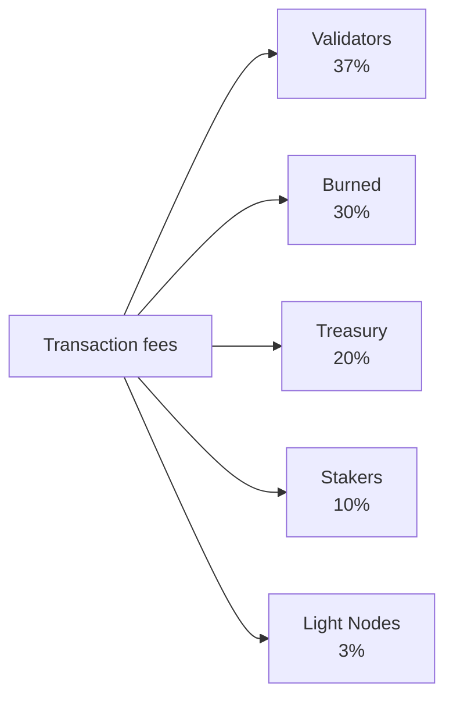

# Tokenomics

QoreChain, yerel **QOR** token'ı merkeze alan **sabit arzlı** bir ekonomik model kullanır. Ağ, arzı zaman içinde şişirmek yerine, staking ödüllerini sonlu, önceden tahsis edilmiş bir emisyon bütçesinden finanse ederken, çok kanallı bir yakma motoru ağ kullanımı arttıkça sürekli deflasyonist baskı uygular.

---

## Token Temelleri

| Özellik                  | Değer                                                    |
| ------------------------- | -------------------------------------------------------- |
| **Görüntülenen token**   | QOR                                                      |
| **Temel birim**           | uqor                                                     |
| **Ondalık hassasiyet**    | 10^6 (1 QOR = 1.000.000 uqor)                            |
| **Toplam arz**            | 4.500.000.000 QOR (sabit)                                |
| **Zincir ID**             | `qorechain-vladi` (mainnet, EVM zincir ID 9801)          |
| **Bech32 öneki**          | `qor` (hesaplar: `qor1...`, validatörler: `qorvaloper...`) |

:::note
Bu sayfadaki rakamlar, 7 Haziran 2026'dan bu yana **v3.1.95** zincir sürümünde canlı olan **mainnet**'i (`qorechain-vladi`, EVM zincir ID **9801**) tanımlar. **`qorechain-diana`** testnet'i (EVM zincir ID **9800**) aynı ekonomik modeli paylaşır.
:::

---

## Arz ve Emisyon Modeli

QoreChain'in **toplam arzı 4.500.000.000 QOR ile sabittir**. Arzı şişirmek için asla yeni QOR basılmaz. Bunun yerine:

* **80.000.000 QOR (arzın %1,78'i)**, Token Üretim Etkinliği'nde (TGE) yakıldı.
* Staking ödülleri, zaman içinde azalan bir takvime göre kullanılan **590.000.000 QOR'luk sonlu bir emisyon bütçesinden** ödenir.

Bu, bir arz-enflasyonu modeli değil, **sonlu bir emisyon bütçesine sahip sabit-arz modelidir**. Emisyon bütçesi tükendiğinde, yönetişimin kalan bütçeden tahsis ettiği miktarın ötesinde başka bir ödül emisyonu gerçekleşmez.

### Staking Ödül Takvimi {#staking-reward-schedule}

:::note Emisyon, 26 Ağustos 2026'da yönetişim tarafından sınırlandırıldı
Aşağıdaki azalan takvim, arzın büyük kısmının bağlandığı (bonded) olgun bir ağ hedeflenerek tasarlanmış orijinal tasarımdı. Ağın fiilen bulunduğu durumla — hedefin çok altında, yaklaşık 6,8M QOR bağlı — kıyaslandığında, bağlı stake'in *günlük* olarak yaklaşık %20'sini ödüyordu. Yönetişim önerisi #4, bağlı stake'in %100'ü ile kabul edildi ve 2.122.074 blok yüksekliğinde (2026-08-26 03:27 UTC, zincir sürümü v3.1.94) uygulandı: epoch başına emisyon 2.153.583 QOR'dan **16.239 QOR**'a düştü ve bu modül için yeni, sabit, kümülatif bir **114.285.714 QOR** üst sınırı getirildi — bu bir hata düzeltmesi değil, bir tasarım kararıdır. Sınır yürürlüğe girdiğinde, eski takvim altında zaten **104.680.531 QOR (%91,6) emisyona uğramıştı**; yeni oranda, kalan bakiyenin yaklaşık **1 yıl 11 ay** daha yeteceği tahmin ediliyor; bu sürenin sonunda bu modül kalıcı olarak emisyonu durduracak ve validatör/staker ödülleri yalnızca işlem ücretlerinden gelecek (aşağıdaki [Ücret Dağılımı](#fee-distribution) bölümüne bakın). Aşağıdaki tablo, orijinal tasarım referansı olarak korunmaktadır — artık canlı ödeme oranını tanımlamamaktadır.
:::

Staking ödülleri, 590.000.000 QOR'luk emisyon bütçesinden azalan bir takvime göre dağıtılır:

| Dönem       | Hedef APY                | Emisyon Bütçesi                  |
| ----------- | ----------------------- | -------------------------------- |
| Yıl 1       | %8–12 APY                | 127.500.000 QOR                  |
| Yıl 2       | %6–10 APY                | 106.250.000 QOR                  |
| Yıl 3–4     | %5–8 APY                 | Yıl başına 85.000.000 QOR        |
| Yıl 5+      | Yönetişim tarafından belirlenir | ~186.000.000 QOR kalan     |

APY aralıkları, orijinal dönem başına tasarım hedefleriydi; emisyon yukarıda açıklandığı şekilde sınırlandırıldığı için artık canlı ödeme oranını yansıtmıyorlar. QoreChain şu anda canlı bir APY rakamının hesaplanabileceği bir sorgu uç noktası sunmamaktadır — bu sayfada dahil olmak üzere gördüğünüz herhangi bir belirli staking getiri yüzdesini, bugün zincire karşı doğrulanamaz olarak ve plan yapılacak bir sayı olarak değil, öyle değerlendirin.

---

## x/burn — Çok Kanallı Yakma Motoru

`x/burn` modülü, 10 kanallı bir token yakma sistemi uygular. Yakılan her token, dolaşımdaki arzdan kalıcı olarak kaldırılır ve ağ kullanımı arttıkça sürekli deflasyonist baskı yaratır.

### Yakma Kanalları

| #  | Kanal               | Kaynak                       | Açıklama                                       |
| -- | ------------------- | ----------------------------- | ----------------------------------------------- |
| 1  | `gas_fee`           | İşlem ücretleri                | Tüm gas ücretlerinin %30'u yakılır              |
| 2  | `contract_create`   | Akıllı kontrat dağıtımı        | Kontrat oluşturma başına sabit 100 QOR ücret yakılır |
| 3  | `ai_service`        | AI modülü kullanım ücretleri   | AI hizmet ücretlerinin %50'si yakılır           |
| 4  | `bridge_fee`        | Zincirler arası köprü ücretleri | Köprü ücretlerinin %100'ü yakılır               |
| 5  | `treasury_buyback`  | Hazine işlemleri                | Hazineden periyodik geri alım ve yakma          |
| 6  | `failed_tx`         | Başarısız işlem gası            | Başarısız işlemlerden gelen gas'ın %10'u yakılır |
| 7  | `xqore_penalty`     | xQORE erken çıkış cezaları      | Ceza tutarları yakma sürecinden geçirilir       |
| 8  | `auto_buyback`      | Otomatik geri alım programı     | Protokol düzeyinde otomatik yakmalar            |
| 9  | `tge`               | Token üretim etkinliği          | Tek seferlik genesis yakmaları (80.000.000 QOR) |
| 10 | `rollup_create`     | Rollup dağıtımı                 | Rollup oluşturma stake'inin %1'i yakılır        |

### Ücret Dağılımı {#fee-distribution}

Ağ tarafından toplanan tüm işlem ücretleri, aşağıda gösterildiği gibi beş hedefe bölünür. Paylar zincir üzerinde uygulanır ve her zaman tam olarak %100'e ulaşır.


```mermaid
flowchart LR
    F["Transaction fees"]
    F --> V["Validators<br/>37%"]
    F --> B["Burned<br/>30%"]
    F --> T["Treasury<br/>20%"]
    F --> S["Stakers<br/>10%"]
    F --> L["Light Nodes<br/>3%"]
```

Ağ tarafından toplanan tüm işlem ücretleri beş hedefe bölünür:

| Alıcı              | Pay | Açıklama                                                                |
| ------------------- | ---- | ------------------------------------------------------------------------ |
| **Validatörler**    | %37  | Stake ile orantılı olarak aktif validatör setine dağıtılır               |
| **Yakılan**         | %30  | `gas_fee` yakma kanalı üzerinden arzdan kalıcı olarak kaldırılır         |
| **Hazine**          | %20  | Yönetişim tarafından yönlendirilen harcamalar için topluluk hazinesine tahsis edilir |
| **Stakerlar**       | %10  | Delegasyon ile orantılı olarak tüm QOR stakerlarına dağıtılır            |
| **Light Node'lar**  | %3   | Ağ verisi sunan light node'lara dağıtılır                                |

Paylar zincir üzerinde uygulanır ve her zaman tam olarak %100'e ulaşmalıdır.

:::note Bunlar yapılandırılmış paylardır, doğrulanmış canlı bir ölçüm değildir
Yukarıdaki tablo, `x/burn`'ün yapılandırılmış parametrelerini yansıtır. Canlı zincir durumuna karşı yapılan bir ölçüm çalışması, validatörlere ve stakerlara birlikte fiilen ulaşan etkin toplam payın, bu iki satırın toplamı olan %47'nin altında kaldığını buldu. Bu farkı henüz bağımsız olarak uzlaştırmadık, bu nedenle bu sayfa iki rakamdan birinin doğrulanmış canlı değer olduğunu iddia etmek yerine yapılandırılmış tasarım değerlerini belirtmektedir — kullanım durumunuz kesin güncel dağılıma bağlıysa `x/burn` parametrelerini ve istatistiklerini doğrudan sorgulayın (bkz. [REST/gRPC Uç Noktaları](/api-reference/rest-grpc-endpoints)).
:::

### Yakma Parametreleri

| Parametre               | Varsayılan                  | Açıklama                                      |
| ------------------------ | ---------------------------- | ------------------------------------------------ |
| `gas_burn_rate`          | 0.30                          | Yakılan gas ücretlerinin oranı (%30)             |
| `contract_create_fee`    | 100.000.000 uqor (100 QOR)    | Kontrat oluşturma için sabit yakma ücreti        |
| `ai_service_burn_rate`   | 0.50                          | Yakılan AI hizmet ücretlerinin oranı (%50)       |
| `bridge_burn_rate`       | 1.00                          | Yakılan köprü ücretlerinin oranı (%100)          |
| `failed_tx_burn_rate`    | 0.10                          | Yakılan başarısız işlem gas'ının oranı (%10)     |

Her yakma olayı; kaynağı, tutarı, blok yüksekliği ve ilişkili işlem hash'i ile birlikte zincir üzerinde kaydedilir. Toplu istatistikler kanal başına ve toplamda sorgulanabilir.

---

## x/xqore — Kilitli Staking ve Yönetişim Güçlendirmesi

`x/xqore` modülü, devredilemez, kilitli-staking türevi olan **xQORE**'u tanıtır. Kullanıcılar, xQORE'u 1:1 oranında basmak için QOR kilitler. xQORE sahipleri, güçlendirilmiş yönetişim gücü ve yeniden dağıtılan çıkış cezalarından pay alır.

### Kilit Mekanizması

* **Kilitleme**: xQORE'u 1:1 oranında basmak için xQORE modülüne QOR gönderin.
* **Yönetişim ağırlığı**: xQORE sahipleri, standart QOR stakerlarına kıyasla **2 kat yönetişim oy gücü** alır.
* **Devredilemez**: xQORE hesaplar arasında gönderilemez. Kilitleyen adrese bağlıdır.

### Çıkış Ceza Takvimi

xQORE'dan erken çekim, kilit süresine göre azalan bir ceza gerektirir:

| Kilit Süresi    | Ceza Oranı | Açıklama                                       |
| ---------------- | ------------ | ------------------------------------------------ |
| 30 günden az     | **%50**      | Kilitlenen QOR'un yarısı kaybedilir              |
| 30 -- 90 gün      | **%35**      | Kısa vadeli kilitler için önemli ceza            |
| 90 -- 180 gün     | **%15**      | Orta vadeli taahhüt için azaltılmış ceza         |
| 180 günden fazla | **%0**       | Cezasız tam çekim                                |

### PvP Rebase Yeniden Dağıtımı

Erken çıkışlardan toplanan cezalar basitçe yok edilmez. Bunun yerine, bir PvP (oyuncuya karşı oyuncu) rebase modelini takip ederler:

1. Ceza tutarlarının **%50'si** yakılır (`x/burn` üzerinden `xqore_penalty` kanalıyla yönlendirilir).
2. **%50'si**, kalan tüm xQORE sahiplerine orantılı olarak yeniden dağıtılır.

Bu, uzun vadeli sahipler için pozitif toplamlı bir dinamik yaratır: her erken çıkış, kalan xQORE pozisyonlarının efektif değerini artırır. Rebase'ler her **100 blokta** bir gerçekleşir.

### xQORE Parametreleri

| Parametre                | Varsayılan               | Açıklama                                     |
| ------------------------- | -------------------------- | ----------------------------------------------- |
| `governance_multiplier`   | 2.0                         | xQORE sahipleri için oy gücü çarpanı             |
| `min_lock_amount`         | 1.000.000 uqor (1 QOR)      | Kilitlemek için gereken minimum QOR              |
| `penalty_burn_rate`       | 0.50                        | Yakılan çıkış cezalarının oranı (%50)            |
| `rebase_interval`         | 100 blok                    | PvP rebase olayları arasındaki blok sayısı       |
| `enabled`                 | true                        | Modül etkinleştirme bayrağı                      |

---

## x/inflation — Emisyon Bütçesi Takvimi

Modül adına rağmen, `x/inflation` modülü toplam arzı **şişirmez**. Bu modül, sonlu **590.000.000 QOR'luk** emisyon bütçesinden staking ödüllerinin, azalan [staking ödül takvimine](#staking-reward-schedule) göre serbest bırakılmasını yönetir. Emisyonlar epoch başına hesaplanır ve stakerlara ile validatörlere dağıtılır; bu, yeni arz basmak yerine önceden tahsis edilmiş bütçeyi kullanır.

### Epoch Mekaniği

* **Epoch uzunluğu**: 17.280 blok (5 saniyelik blok sürelerinde \~1 gün)
* **Yıl başına blok**: \~6.311.520
* Her epoch'un başında, mevcut dönem için planlanan emisyon, emisyon bütçesinden serbest bırakılır ve stakerlara ile validatörlere dağıtılır.
* Epoch izleyici; mevcut epoch numarasını, mevcut yılı, başlangıç bloğunu, emisyon bütçesinden serbest bırakılan kümülatif QOR'u ve kalan bütçeyi kaydeder.

### Enflasyon Parametreleri

| Parametre       | Varsayılan        | Açıklama                                                      |
| ---------------- | -------------------- | ------------------------------------------------------------------ |
| `schedule`       | declining             | Döneme göre indekslenmiş emisyon bütçesi (bkz. staking ödül takvimi) |
| `epoch_length`   | 17.280 blok           | Emisyon epoch'u başına blok sayısı                                  |
| `enabled`        | true                  | Modül etkinleştirme bayrağı                                         |

---

## Deflasyonist Dinamikler

Arz sabit olduğundan ve emisyon sonlu bir bütçeden çekildiğinden, QoreChain'in net token dinamikleri benimseme arttıkça deflasyonist yöne eğilim gösterir:

```
Yıl 1-2:   Bütçeden gelen daha büyük planlanmış emisyonlar yakmaları dengeler → arz neredeyse nötr
Yıl 3-4:   Planlanmış emisyonlar azalır; yakma hacmi kullanımla birlikte artar → yakınsama
Yıl 5+:    Emisyon bütçesi büyük ölçüde tükenmiştir; yakma kanalları (gas, köprü,
           kontratlar, rollup'lar) işlem hacmiyle ölçeklenir → net deflasyonist
```

10 yakma kanalı, her büyük ağ etkinliğinin arzdan token kaldırmasını sağlar. İşlem hacmi, köprü kullanımı, AI hizmet çağrıları ve rollup dağıtımları arttıkça, kümülatif yakmalar hızlanırken planlanmış emisyonlar sonlu bütçenin sonuna doğru azalır.

---

## Modül Yaşam Döngüsü Sırası

Ekonomik modüller, her bloğun `EndBlocker`'ı sırasında belirli bir sırada çalışır:

```
x/burn → x/xqore → x/inflation → x/rlconsensus
```

1. **x/burn** — Bekleyen yakma kayıtlarını işler ve toplu istatistikleri günceller.
2. **x/xqore** — PvP rebase'lerini (her `rebase_interval` blokta bir) yürütür ve cezaları yakmaya yönlendirir.
3. **x/inflation** — Epoch sınırlarında bütçeden planlanmış staking ödül emisyonlarını serbest bırakır.
4. **x/rlconsensus** — PRISM pekiştirmeli öğrenme sinyallerine dayanarak konsensüs parametrelerini ayarlar.

Bu sıralama, yakmaların rebase'lerden önce sonlandırılmasını ve rebase'lerin planlanmış emisyonlar serbest bırakılmadan önce tamamlanmasını sağlayarak tutarlı ekonomik durum geçişlerini korur.

## İlgili

* [Zincir Parametreleri](/appendix/chain-parameters) — kanonik ekonomik ve konsensüs varsayılanları.
* [Staking ve Delegasyon](/user-guide/staking-and-delegation) — QOR delege edin ve ödül kazanın.
* [xQORE Staking](/user-guide/xqore-staking) — PvP rebase staking mekanizması.
* [Light Node Ödülleri](/light-node/rewards-and-monitoring) — light node ödül payı.
