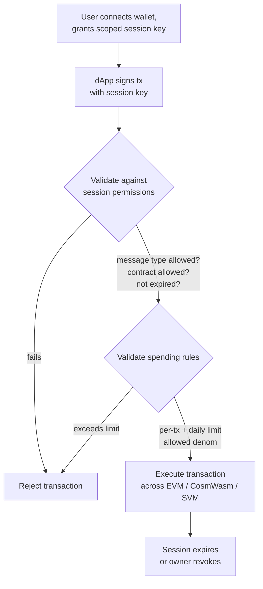

# Hesap Soyutlama

QoreChain, `x/abstractaccount` modülü aracılığıyla **protokol düzeyinde hesap soyutlama** sağlar. Bu, esnek kimlik doğrulama kuralları, oturum anahtarları, harcama limitleri ve sosyal kurtarma içeren programlanabilir hesapları mümkün kılar — tümü harici akıllı sözleşme altyapısı gerektirmeden.

:::note
Aşağıdaki komutlar, 7 Haziran 2026'dan beri **v3.1.77** zincir sürümünü çalıştırarak yayında olan **`qorechain-vladi`** ana ağını kullanır. Test ağı için `--chain-id qorechain-diana` ifadesini yerine koyun.
:::

## Genel Bakış

Geleneksel blok zinciri hesapları tek bir özel anahtar tarafından denetlenir. Hesap soyutlama, "bir işlemi kimin yetkilendirebileceği" kavramını tek bir kriptografik anahtardan ayırarak şunları mümkün kılar:

* Yapılandırılabilir eşik imzalamaya sahip **çoklu imza hesapları**
* Koruyucu tabanlı anahtar kurtarmaya sahip **sosyal kurtarma hesapları**
* dApp'ler için ayrıntılı, zaman sınırlı izinlere sahip **oturum tabanlı hesaplar**

`x/abstractaccount` modülü bu yetenekleri protokol katmanında uygular; bu da bunların üç VM'in (EVM, CosmWasm, SVM) tümünde çalıştığı ve yerel gaz verimliliğinden yararlandığı anlamına gelir.

*Oturum tabanlı bir dApp akışı: kapsamı belirlenmiş bir oturum anahtarı bir işlemi imzalar, modül bunu oturum ve harcama kurallarına göre doğrular, ardından yürütür.*



## Hesap Türleri

| Tür               | Açıklama                                | Kullanım Senaryosu             |
| ----------------- | --------------------------------------- | ------------------------------ |
| `multisig`        | N'den M eşik imzalama                    | DAO hazineleri, paylaşılan cüzdanlar |
| `social_recovery` | Koruyucu destekli anahtar kurtarma      | Tüketici cüzdanları, başlangıç adımları |
| `session_based`   | Kısıtlamalı yetkilendirilmiş oturum anahtarları | dApp oturumları, mobil cüzdanlar  |

## Soyut Hesap Oluşturma

### Oturum Tabanlı Hesap

```bash
qorechaind tx abstractaccount create \
  --account-type session_based \
  --from mykey \
  --gas auto \
  -y
```

### Çoklu İmza Hesabı

```bash
qorechaind tx abstractaccount create \
  --account-type multisig \
  --signers qor1alice...,qor1bob...,qor1carol... \
  --threshold 2 \
  --from mykey \
  --gas auto \
  -y
```

### Sosyal Kurtarma Hesabı

```bash
qorechaind tx abstractaccount create \
  --account-type social_recovery \
  --guardians qor1guardian1...,qor1guardian2...,qor1guardian3... \
  --recovery-threshold 2 \
  --from mykey \
  --gas auto \
  -y
```

## Oturum Anahtarları

Oturum anahtarları, `session_based` hesap türünün temel taşıdır. İkincil bir anahtara **geçici, kapsamı belirlenmiş izinler** vermenizi sağlarlar — birincil anahtarınızı ifşa etmek istemediğiniz dApp etkileşimleri için mükemmeldir.

### Anahtar Özellikleri

| Özellik               | Açıklama                                             |
| --------------------- | ---------------------------------------------------- |
| **İzinler**           | Oturum anahtarının imzalayabileceği mesaj türleri    |
| **Sona erme**         | Yapılandırılabilir bir süre sonunda otomatik sona erme |
| **Harcama limitleri** | Oturum anahtarının harcayabileceği maksimum tutarlar |
| **İzin verilen sözleşmeler** | Etkileşimleri belirli sözleşme adresleriyle sınırla |

### Oturum Anahtarı Ver

```bash
qorechaind tx abstractaccount grant-session \
  --session-key qor1sessionkey... \
  --permissions "bank/MsgSend,wasm/MsgExecuteContract" \
  --expiry "2026-03-01T00:00:00Z" \
  --allowed-contracts qor1contract1...,0x1234...abcd \
  --from mykey \
  -y
```

### Oturum Anahtarını İptal Et

```bash
qorechaind tx abstractaccount revoke-session \
  --session-key qor1sessionkey... \
  --from mykey \
  -y
```

### Etkin Oturumları Listele

```bash
qorechaind query abstractaccount sessions <account-address>
```

## Harcama Kuralları

Harcama kuralları, hesap türünden bağımsız olarak soyut hesaplara finansal korkuluklar ekler:

| Kural            | Açıklama                                        |
| ---------------- | ----------------------------------------------- |
| `daily_limit`    | 24 saatlik kayan pencere başına maksimum toplam harcama |
| `per_tx_limit`   | İşlem başına maksimum harcama                    |
| `allowed_denoms` | Hangi token birimlerinin harcanabileceğini sınırla |

### Harcama Kurallarını Ayarla

```bash
qorechaind tx abstractaccount update-spending-rules \
  --daily-limit 1000000000uqor \
  --per-tx-limit 100000000uqor \
  --allowed-denoms uqor \
  --from mykey \
  -y
```

### Mevcut Kuralları Sorgula

```bash
qorechaind query abstractaccount spending-rules <account-address>
```

### Örnek Yanıt

```json
{
  "daily_limit": {
    "denom": "uqor",
    "amount": "1000000000"
  },
  "per_tx_limit": {
    "denom": "uqor",
    "amount": "100000000"
  },
  "allowed_denoms": ["uqor"],
  "daily_spent": {
    "denom": "uqor",
    "amount": "250000000"
  },
  "window_reset": "2026-02-27T00:00:00Z"
}
```

## Soyut Hesapları Sorgulama

### CLI

```bash
# Get full account configuration
qorechaind query abstractaccount account <address>

# List all abstract accounts (paginated)
qorechaind query abstractaccount list --limit 10
```

### JSON-RPC

```bash
curl -X POST http://localhost:8545 \
  -H "Content-Type: application/json" \
  -d '{
    "jsonrpc": "2.0",
    "method": "qor_getAbstractAccount",
    "params": ["0xYourAddress"],
    "id": 1
  }'
```

### Örnek Hesap Yanıtı

```json
{
  "address": "qor1myaccount...",
  "account_type": "session_based",
  "owner": "qor1owner...",
  "active_sessions": 2,
  "spending_rules": {
    "daily_limit": "1000000000uqor",
    "per_tx_limit": "100000000uqor",
    "allowed_denoms": ["uqor"]
  },
  "created_at_height": 54321
}
```

## Sosyal Kurtarma Akışı

Hesap sahibi birincil anahtarına erişimini kaybederse, koruyucular bir anahtar değişimini yetkilendirebilir.

1. **Sahip kayıp anahtarı bildirir (veya bir koruyucu başlatır):**

   ```bash
   qorechaind tx abstractaccount initiate-recovery \
     --account <account-address> \
     --new-owner qor1newkey... \
     --from guardian1 \
     -y
   ```

2. **Ek koruyucular onaylar** (`recovery_threshold` değerini karşılamalıdır):

   ```bash
   qorechaind tx abstractaccount approve-recovery \
     --account <account-address> \
     --recovery-id <recovery-id> \
     --from guardian2 \
     -y
   ```

3. **Kurtarma otomatik olarak yürütülür** eşiğe ulaşıldığında. Bir **zaman kilidi süresi** (varsayılan: 48 saat), asıl sahibe hileli bir kurtarma girişimini iptal etme şansı verir.

## dApp'lerle Entegrasyon

Oturum anahtarları sorunsuz dApp deneyimlerini mümkün kılar:

1. **Kullanıcı cüzdanı bağlar** ve dApp'in sözleşmesine kapsamı belirlenmiş bir oturum anahtarı oluşturur
2. **dApp oturum anahtarını kullanır** kullanıcı adına işlem göndermek için
3. **Tekrar tekrar imzalama yok** — oturum anahtarı, izinleri dahilinde yetkilendirmeyi yönetir
4. **Oturum otomatik olarak sona erer** veya kullanıcı istediği zaman iptal eder

Bu kalıp özellikle şunlar için yararlıdır:

* Tekrar tekrar biyometrik istemlerin sıkıntı yarattığı mobil cüzdanlar
* Hızlı işlem imzalamaya ihtiyaç duyan oyun dApp'leri
* Birden çok ardışık işlem yürüten DeFi protokolleri

## Sonraki Adımlar

* [Doğrulayıcı Çalıştırma](/developer-guide/running-a-validator) — Bir doğrulayıcı düğümü kurun ve işletin
* [EVM Geliştirme](/developer-guide/evm-development) — Soyut hesapları Solidity dApp'leriyle entegre edin
* [VM'ler Arası Birlikte Çalışabilirlik](/developer-guide/cross-vm-interoperability) — Soyut hesaplarla VM'ler arası mesajlaşma
