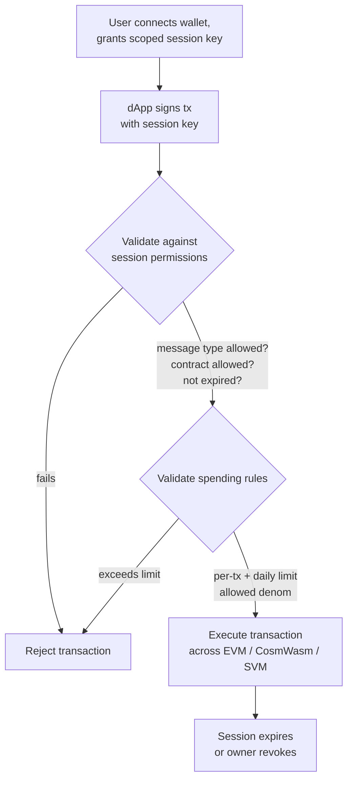

# Hesap Soyutlama

QoreChain, `x/abstractaccount` modülü aracılığıyla **protokol düzeyinde hesap soyutlama** sağlar. Bu, harici akıllı sözleşme altyapısına ihtiyaç duymadan esnek kimlik doğrulama kuralları, oturum anahtarları, harcama limitleri ve sosyal kurtarma ile programlanabilir hesapları mümkün kılar.

:::note
Aşağıdaki komutlar, 7 Haziran 2026'dan beri canlı olan ve **v3.1.92** zincir sürümünü çalıştıran **`qorechain-vladi`** ana ağını kullanır. Test ağı için `--chain-id qorechain-diana` ile değiştirin.
:::

## Genel Bakış

Geleneksel blok zinciri hesapları tek bir özel anahtar tarafından kontrol edilir. Hesap soyutlama, "bir işlemi kimin yetkilendirebileceği" kavramını tek bir kriptografik anahtardan ayırarak şunları mümkün kılar:

* Yapılandırılabilir eşik imzalamaya sahip **çoklu imza hesapları**
* Vasi tabanlı anahtar kurtarmaya sahip **sosyal kurtarma hesapları**
* dApp'ler için ayrıntılı, süreli izinlere sahip **oturum tabanlı hesaplar**

`x/abstractaccount` modülü bu yetenekleri protokol katmanında uygular; bu da bunların her üç VM'de (EVM, CosmWasm, SVM) çalıştığı ve doğal gaz verimliliğinden yararlandığı anlamına gelir.

*Oturum tabanlı bir dApp akışı: kapsamlandırılmış bir oturum anahtarı bir işlemi imzalar, modül bunu oturum ve harcama kurallarına göre doğrular, ardından yürütür.*


```mermaid
flowchart TD
    A["User connects wallet,<br/>grants scoped session key"] --> B["dApp signs tx<br/>with session key"]
    B --> C{"Validate against<br/>session permissions"}
    C -- "message type allowed?<br/>contract allowed?<br/>not expired?" --> D{"Validate spending rules"}
    C -- "fails" --> R["Reject transaction"]
    D -- "per-tx + daily limit<br/>allowed denom" --> E["Execute transaction<br/>across EVM / CosmWasm / SVM"]
    D -- "exceeds limit" --> R
    E --> F["Session expires<br/>or owner revokes"]
```

## Hesap Türleri

| Tür               | Açıklama                                | Kullanım Alanı                  |
| ----------------- | ---------------------------------------- | ------------------------------- |
| `multisig`        | M-of-N eşik imzalama                     | DAO hazineleri, paylaşılan cüzdanlar |
| `social_recovery` | Vasi destekli anahtar kurtarma           | Tüketici cüzdanları, kayıt süreci |
| `session_based`   | Kısıtlamalı, devredilmiş oturum anahtarları | dApp oturumları, mobil cüzdanlar |

## Soyut Hesap Oluşturma

### Oturum Tabanlı Hesap

```bash
qorechaind tx abstractaccount create \
  --account-type session_based \
  --from mykey \
  --gas auto \
  -y
```

### Çoklu İmza Hesabı

```bash
qorechaind tx abstractaccount create \
  --account-type multisig \
  --signers qor1alice...,qor1bob...,qor1carol... \
  --threshold 2 \
  --from mykey \
  --gas auto \
  -y
```

### Sosyal Kurtarma Hesabı

```bash
qorechaind tx abstractaccount create \
  --account-type social_recovery \
  --guardians qor1guardian1...,qor1guardian2...,qor1guardian3... \
  --recovery-threshold 2 \
  --from mykey \
  --gas auto \
  -y
```

## Oturum Anahtarları

Oturum anahtarları, `session_based` hesap türünün temel taşıdır. Birincil anahtarınızı ortaya çıkarmak istemediğiniz dApp etkileşimleri için ideal olan, ikincil bir anahtara **geçici, kapsamlandırılmış izinler** vermenizi sağlar.

### Anahtar Özellikleri

| Özellik                | Açıklama                                                |
| ----------------------- | -------------------------------------------------------- |
| **İzinler**              | Oturum anahtarının imzalayabileceği mesaj türleri         |
| **Süre sonu**            | Yapılandırılabilir bir süre sonunda otomatik sona erme    |
| **Harcama limitleri**    | Oturum anahtarının harcayabileceği maksimum tutarlar       |
| **İzin verilen sözleşmeler** | Etkileşimleri belirli sözleşme adresleriyle kısıtlama |

### Oturum Anahtarı Verme

```bash
qorechaind tx abstractaccount grant-session \
  --session-key qor1sessionkey... \
  --permissions "bank/MsgSend,wasm/MsgExecuteContract" \
  --expiry "2026-03-01T00:00:00Z" \
  --allowed-contracts qor1contract1...,0x1234...abcd \
  --from mykey \
  -y
```

### Oturum Anahtarını İptal Etme

```bash
qorechaind tx abstractaccount revoke-session \
  --session-key qor1sessionkey... \
  --from mykey \
  -y
```

### Aktif Oturumları Listeleme

```bash
qorechaind query abstractaccount sessions <account-address>
```

## Harcama Kuralları

Harcama kuralları, hesap türünden bağımsız olarak soyut hesaplara finansal korumalar ekler:

| Kural             | Açıklama                                            |
| ------------------ | ------------------------------------------------------ |
| `daily_limit`      | 24 saatlik kayan pencere başına maksimum toplam harcama |
| `per_tx_limit`     | Tek bir işlem başına maksimum harcama                    |
| `allowed_denoms`   | Harcanabilecek token birimlerini kısıtlar                |

### Harcama Kurallarını Ayarlama

```bash
qorechaind tx abstractaccount update-spending-rules \
  --daily-limit 1000000000uqor \
  --per-tx-limit 100000000uqor \
  --allowed-denoms uqor \
  --from mykey \
  -y
```

### Mevcut Kuralları Sorgulama

```bash
qorechaind query abstractaccount spending-rules <account-address>
```

### Örnek Yanıt

```json
{
  "daily_limit": {
    "denom": "uqor",
    "amount": "1000000000"
  },
  "per_tx_limit": {
    "denom": "uqor",
    "amount": "100000000"
  },
  "allowed_denoms": ["uqor"],
  "daily_spent": {
    "denom": "uqor",
    "amount": "250000000"
  },
  "window_reset": "2026-02-27T00:00:00Z"
}
```

## Bağlı Cüzdan Kimlik Doğrulayıcıları — Devredilmiş Harcama {#authenticators}

**v3.1.85** zincir sürümünden itibaren (v3.1.84 izin modeli üzerine inşa edilerek), **bağlı bir harici cüzdan anahtarı** — bir Phantom (ed25519) anahtarı ya da bir MetaMask (secp256k1) hesabı — en az ayrıcalık, harcama limitli ve iptal edilebilir koşullar altında **kanonik post-kuantum hesaptan harcama yapabilir**. Harici anahtar hiçbir zaman bir ML-DSA imzası üretmez; bir **röle (relayer)** işlem zarfını gönderir ve ödemesini yapar (röle'nin kendi hibrit PQC imzası zincirin imzalama gereksinimlerini karşılar), kimlik doğrulayıcının **alan ayrımlı, tekrar oynatmaya karşı bağlanmış imza baytları** üzerindeki imzası ise yetkilendirmeyi oluşturur.

### Kimlik doğrulayıcı kaydetme {#register-authenticator}

Hesap sahibi, harici anahtarı `MsgRegisterAuthenticator` ile kaydeder (sıradan bir kök anahtar işlemi); bu işlemde bir şema, izinler, bir süre sonu ve isteğe bağlı harcama limitleri belirtilir:

```js
import { registerEthAuthenticatorMsg } from "@qorechain/wallet-adapter";

// Link a MetaMask account by its 20-byte address (EIP-191 verification):
const msg = registerEthAuthenticatorMsg({
  account: "qor1owner...",            // the canonical account
  ethAddress: "0xAbC...123",          // the MetaMask address to link
  permissions: ["evm"],               // least privilege — see the taxonomy below
  expirySeconds: 30 * 24 * 3600,      // ≤ 30 days recommended
  spendingRule: { perTxLimit: "100000000uqor", dailyLimit: "1000000000uqor" },
});
// Sign & broadcast this msg with the OWNER's normal hybrid-PQC signer.
```

Bir Phantom anahtarı, `scheme: "ed25519"` ve Phantom ortak anahtarı ile aynı şekilde kaydedilir. İptal işlemi `MsgRevokeAuthenticator` ile anında gerçekleşir.

### İzin taksonomisi {#permission-taxonomy}

Bir kimlik doğrulayıcının kaydedilmesi durumunda ne yapabileceğini on bir kurallı izin belirler. Eşleme **fail-closed**'dır: eşlemesi olmayan bir mesaj türü reddedilir.

| İzin | Sağladığı Yetki |
| --- | --- |
| `send` | Native-lane banka transferleri |
| `delegate` / `withdraw` / `vote` | Stake etme, ödül çekme, yönetişim |
| `evm` / `wasm` / `svm` | İlgili VM hattında yürütme |
| `amm` / `ibc` / `deploy` | AMM işlemleri, IBC transferleri, sözleşme dağıtımı |
| `all` | Devredilebilir herhangi bir mesaj |

**Anahtar yönetimi mesajları asla devredilemez** — `MsgRegisterAuthenticator`, `MsgRevokeAuthenticator`, PQC anahtar kaydı/geçişi ve `MsgRotatePQCKey` her zaman kök anahtarı gerektirir; böylece bağlı bir anahtar kendi ayrıcalıklarını asla yükseltemez.

Sabit kodlamak yerine (kayma tespiti için `schema_version` içeren) canlı taksonomiyi okuyun:

```bash
curl -s https://api.qore.host/qorechain/abstractaccount/v1/permission_schema | jq
# or: qorechaind query abstractaccount permission-schema
```

### Bağlı bir anahtarla harcama yapma {#execute-messages}

Kimlik doğrulayıcı tarafından yetkilendirilen eylemleri iki mesaj taşır. Her ikisinde de röle, işlemin imzalayıcısı/ücret ödeyicisidir; kimlik doğrulayıcının imzası mesajın içinde taşınır.

**`MsgExecuteEVM`** — **kanonik hesabın `0x…` adresinden** yapılan bir EVM çağrısı veya transferi. Kimlik doğrulayıcı `sha256("qorechain-evm-auth-v1" ‖ chainId ‖ account ‖ pubkey ‖ to ‖ value ‖ data ‖ nonce)` değerini imzalar (tüm alanlar uzunluk ön ekli). Tekrar oynatma koruması hesabın kendi EVM nonce'udur.

**`MsgExecuteCosmos`** — kanonik hesaptan yapılan bir Native-lane banka gönderimi. Kimlik doğrulayıcı `sha256("qorechain-cosmos-auth-v1" ‖ chainId ‖ account ‖ pubkey ‖ to ‖ amount ‖ nonce)` değerini imzalar. Tekrar oynatma koruması, modül tarafından tutulan **kimlik doğrulayıcı başına bir sıra numarasıdır** (bir banka gönderimi hesabın nonce'unu artırmaz). Kendine gönderimler reddedilir.

:::caution Nonce kuralları
* `MsgExecuteEVM.nonce` = hesabın **mevcut** EVM nonce'u (`eth_getTransactionCount(account0x, "latest")`). Üretimde röle *farklı* bir hesap olduğundan, +1 **eklemeyin**. Eski bir nonce'un imzalanması `11` kodunu döndürür.
* `MsgExecuteCosmos.nonce` = kimlik doğrulayıcı başına sıra numarası (hesabın kimlik doğrulayıcı durumunu sorgulayın), hesabın Cosmos sıra numarası **değil**.
:::

**Phantom örneği** (tarayıcı: Phantom imzalar, arka ucunuz röleler):

```js
import { buildPhantomExecuteCosmos } from "@qorechain/wallet-adapter";

// In the dApp: Phantom signs the digest with ed25519 signMessage.
const msg = await buildPhantomExecuteCosmos({
  provider: window.solana,            // Phantom
  chainId: "qorechain-vladi",
  account: "qor1owner...",            // canonical account being spent from
  to: "qor1recipient...",
  amount: { denom: "uqor", amount: "900000" },
  nonce: authSequence,                // per-authenticator sequence
});
// Send `msg` to your relayer; the relayer wraps it in a tx it signs
// (hybrid PQC) and broadcasts. The transfer moves the OWNER's funds.
```

**MetaMask örneği** (bağlı 20 baytlık adresten EIP-191 `personal_sign`):

```js
import { buildMetaMaskExecuteEvm } from "@qorechain/wallet-adapter";

const msg = await buildMetaMaskExecuteEvm({
  provider: window.ethereum,          // MetaMask (EIP-1193)
  chainId: "qorechain-vladi",
  account: "qor1owner...",
  to: "0xRecipient...",
  valueWei: 10n ** 16n,               // 0.01 QOR (18-dec EVM view)
  nonce: currentEvmNonce,             // eth_getTransactionCount(owner0x, "latest")
});
// Relay as above. The chain verifies the signature via EIP-191 + ecrecover
// against the registered 20-byte address.
```

Aynı oluşturucular, beş dilin tümü için [QoreChain SDK](/sdk/guides/authenticators)'da ve buna karşılık gelen CLI komutlarında da mevcuttur:

```bash
# Produce the exact sign bytes the chain verifies (for custom signers):
qorechaind query abstractaccount auth-sign-cosmos <account> <to> <amount> <nonce>
qorechaind query abstractaccount auth-sign-evm <account> <to> <value> <data-hex> <nonce>

# Relay a pre-signed authorization:
qorechaind tx abstractaccount execute-cosmos <account> <to> <amount> <auth-pubkey> <auth-sig> <nonce> --from relayer -y
qorechaind tx abstractaccount execute-evm    <account> <to> <value> <data-hex> <auth-pubkey> <auth-sig> <nonce> --from relayer -y
```

### Hata kodları {#authenticator-errors}

Uygulama hataları, cüzdanların doğru mesajı gösterebilmesi için ayrı kodlar döndürür (kod alanı `abstractaccount`):

| Kod | Anlamı | Cüzdan Arayüzü |
| --- | --- | --- |
| `5` | Harcama limiti aşıldı (işlem başına veya günlük) | Kalan izni gösterin |
| `6` | Kimlik doğrulayıcının süresi doldu | "Süresi doldu — cüzdanınızı yeniden bağlayın" |
| `10` | İzin reddedildi (kapsam veya devredilemeyen mesaj) | Eksik izni gösterin |
| `11` | Tekrar oynatma reddedildi (eski nonce/sıra numarası) | Nonce'u yeniden sorgulayın ve yeniden imzalayın |

(Kod alanı `pqc`, kod `21` = hibrit imza doğrulaması başarısız oldu — bir yetkilendirme sorunu değil, röle tarafında bir imzalama sorunu.)

### REST sorguları {#abstractaccount-rest}

**v3.1.85** sürümünden itibaren modülün okuma sorguları REST üzerinden de sunulur:

```
GET /qorechain/abstractaccount/v1/config
GET /qorechain/abstractaccount/v1/accounts
GET /qorechain/abstractaccount/v1/accounts/{address}
GET /qorechain/abstractaccount/v1/permission_schema
```

## Soyut Hesapları Sorgulama

### CLI

```bash
# Get full account configuration
qorechaind query abstractaccount account <address>

# List all abstract accounts (paginated)
qorechaind query abstractaccount list --limit 10
```

### JSON-RPC

```bash
curl -X POST http://localhost:8545 \
  -H "Content-Type: application/json" \
  -d '{
    "jsonrpc": "2.0",
    "method": "qor_getAbstractAccount",
    "params": ["0xYourAddress"],
    "id": 1
  }'
```

### Örnek Hesap Yanıtı

```json
{
  "address": "qor1myaccount...",
  "account_type": "session_based",
  "owner": "qor1owner...",
  "active_sessions": 2,
  "spending_rules": {
    "daily_limit": "1000000000uqor",
    "per_tx_limit": "100000000uqor",
    "allowed_denoms": ["uqor"]
  },
  "created_at_height": 54321
}
```

## Sosyal Kurtarma Akışı

Hesap sahibi birincil anahtarına erişimini kaybederse, vasiler bir anahtar rotasyonunu yetkilendirebilir.

1. **Sahip kayıp anahtarı bildirir (ya da bir vasi süreci başlatır):**

   ```bash
   qorechaind tx abstractaccount initiate-recovery \
     --account <account-address> \
     --new-owner qor1newkey... \
     --from guardian1 \
     -y
   ```

2. **Ek vasiler onaylar** (`recovery_threshold` karşılanmalıdır):

   ```bash
   qorechaind tx abstractaccount approve-recovery \
     --account <account-address> \
     --recovery-id <recovery-id> \
     --from guardian2 \
     -y
   ```

3. Eşik karşılandığında **kurtarma otomatik olarak yürütülür**. Bir **zaman kilidi süresi** (varsayılan: 48 saat), orijinal sahibe hileli bir kurtarma girişimini iptal etme fırsatı tanır.

## dApp'lerle Entegrasyon

Oturum anahtarları sorunsuz dApp deneyimleri sağlar:

1. **Kullanıcı cüzdanını bağlar** ve dApp'in sözleşmesine kapsamlandırılmış bir oturum anahtarı oluşturur
2. **dApp, oturum anahtarını kullanır** ve kullanıcı adına işlemler gönderir
3. **Tekrar tekrar imzalama gerekmez** — oturum anahtarı, kendi izinleri dahilinde yetkilendirmeyi yönetir
4. **Oturum otomatik olarak sona erer** ya da kullanıcı istediği zaman iptal edebilir

Bu model özellikle şunlar için kullanışlıdır:

* Tekrarlanan biyometrik istemlerin rahatsız edici olduğu mobil cüzdanlar
* Hızlı işlem imzalama gerektiren oyun dApp'leri
* Birden çok ardışık işlem yürüten DeFi protokolleri

## Sonraki Adımlar

* [Validator Çalıştırma](/developer-guide/running-a-validator) — Bir validator düğümü kurma ve işletme
* [EVM Geliştirme](/developer-guide/evm-development) — Soyut hesapları Solidity dApp'leriyle entegre etme
* [VM'ler Arası Birlikte Çalışabilirlik](/developer-guide/cross-vm-interoperability) — Soyut hesaplarla VM'ler arası mesajlaşma
