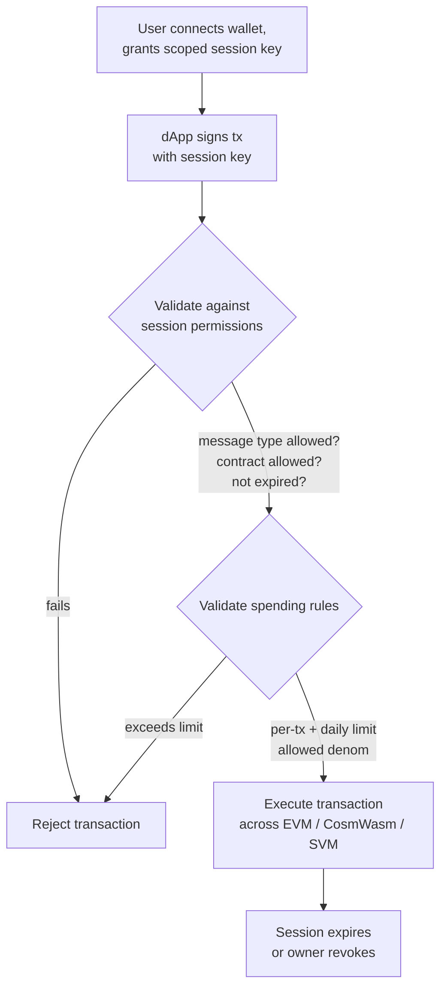

# Hesap Soyutlama

QoreChain, `x/abstractaccount` modülü aracılığıyla **protokol düzeyinde hesap soyutlama** sağlar. Bu, esnek kimlik doğrulama kuralları, oturum anahtarları, harcama limitleri ve sosyal kurtarma özelliklerine sahip programlanabilir hesapları — harici akıllı sözleşme altyapısı gerektirmeden — mümkün kılar.

:::note
Aşağıdaki komutlar, 7 Haziran 2026'dan bu yana yayında olan ve zincir sürümü **v3.1.85** ile çalışan **`qorechain-vladi`** ana ağını kullanır. Test ağı için `--chain-id qorechain-diana` kullanın.
:::

## Genel Bakış

Geleneksel blokzincir hesapları tek bir özel anahtar tarafından kontrol edilir. Hesap soyutlama, "bir işlemi kimin yetkilendirebileceği" kavramını tek bir kriptografik anahtardan ayırarak şunları mümkün kılar:

* Yapılandırılabilir eşikli imzalamaya sahip **multisig hesaplar**
* Vasi (guardian) tabanlı anahtar kurtarma özellikli **sosyal kurtarma hesapları**
* dApp'ler için ayrıntılı, süre sınırlı izinlere sahip **oturum tabanlı hesaplar**

`x/abstractaccount` modülü bu yetenekleri protokol katmanında uygular; bu da her üç VM'de (EVM, CosmWasm, SVM) çalıştıkları ve yerel gas verimliliğinden yararlandıkları anlamına gelir.

*Oturum tabanlı bir dApp akışı: kapsamı belirlenmiş bir oturum anahtarı işlemi imzalar, modül bunu oturum ve harcama kurallarına göre doğrular, ardından yürütür.*


```mermaid
flowchart TD
    A["User connects wallet,<br/>grants scoped session key"] --> B["dApp signs tx<br/>with session key"]
    B --> C{"Validate against<br/>session permissions"}
    C -- "message type allowed?<br/>contract allowed?<br/>not expired?" --> D{"Validate spending rules"}
    C -- "fails" --> R["Reject transaction"]
    D -- "per-tx + daily limit<br/>allowed denom" --> E["Execute transaction<br/>across EVM / CosmWasm / SVM"]
    D -- "exceeds limit" --> R
    E --> F["Session expires<br/>or owner revokes"]
```

## Hesap Türleri

| Tür               | Açıklama                                        | Kullanım Senaryosu                      |
| ----------------- | ------------------------------------------------ | ---------------------------------------- |
| `multisig`        | M-of-N eşikli imzalama                           | DAO hazineleri, paylaşımlı cüzdanlar     |
| `social_recovery` | Vasi destekli anahtar kurtarma                   | Tüketici cüzdanları, kullanıcı kazanımı  |
| `session_based`   | Kısıtlamalı yetkilendirilmiş oturum anahtarları  | dApp oturumları, mobil cüzdanlar         |

## Soyut Hesap Oluşturma

### Oturum Tabanlı Hesap

```bash
qorechaind tx abstractaccount create \
  --account-type session_based \
  --from mykey \
  --gas auto \
  -y
```

### Multisig Hesap

```bash
qorechaind tx abstractaccount create \
  --account-type multisig \
  --signers qor1alice...,qor1bob...,qor1carol... \
  --threshold 2 \
  --from mykey \
  --gas auto \
  -y
```

### Sosyal Kurtarma Hesabı

```bash
qorechaind tx abstractaccount create \
  --account-type social_recovery \
  --guardians qor1guardian1...,qor1guardian2...,qor1guardian3... \
  --recovery-threshold 2 \
  --from mykey \
  --gas auto \
  -y
```

## Oturum Anahtarları

Oturum anahtarları, `session_based` hesap türünün temel taşıdır. İkincil bir anahtara **geçici, kapsamı belirlenmiş izinler** vermenizi sağlarlar — birincil anahtarınızı açığa çıkarmak istemediğiniz dApp etkileşimleri için idealdir.

### Temel Özellikler

| Özellik                      | Açıklama                                                  |
| ---------------------------- | ---------------------------------------------------------- |
| **İzinler**                  | Oturum anahtarının hangi mesaj türlerini imzalayabileceği   |
| **Süre sonu**                | Yapılandırılabilir bir süre sonunda otomatik sona erme      |
| **Harcama limitleri**        | Oturum anahtarının harcayabileceği azami tutarlar           |
| **İzin verilen sözleşmeler** | Etkileşimleri belirli sözleşme adresleriyle sınırlama       |

### Oturum Anahtarı Verme

```bash
qorechaind tx abstractaccount grant-session \
  --session-key qor1sessionkey... \
  --permissions "bank/MsgSend,wasm/MsgExecuteContract" \
  --expiry "2026-03-01T00:00:00Z" \
  --allowed-contracts qor1contract1...,0x1234...abcd \
  --from mykey \
  -y
```

### Oturum Anahtarını İptal Etme

```bash
qorechaind tx abstractaccount revoke-session \
  --session-key qor1sessionkey... \
  --from mykey \
  -y
```

### Aktif Oturumları Listeleme

```bash
qorechaind query abstractaccount sessions <account-address>
```

## Harcama Kuralları

Harcama kuralları, hesap türünden bağımsız olarak soyut hesaplara finansal koruma bariyerleri ekler:

| Kural            | Açıklama                                                |
| ---------------- | -------------------------------------------------------- |
| `daily_limit`    | 24 saatlik kayan pencere başına azami toplam harcama      |
| `per_tx_limit`   | İşlem başına azami harcama                                |
| `allowed_denoms` | Hangi token birimlerinin harcanabileceğini sınırlama      |

### Harcama Kurallarını Ayarlama

```bash
qorechaind tx abstractaccount update-spending-rules \
  --daily-limit 1000000000uqor \
  --per-tx-limit 100000000uqor \
  --allowed-denoms uqor \
  --from mykey \
  -y
```

### Mevcut Kuralları Sorgulama

```bash
qorechaind query abstractaccount spending-rules <account-address>
```

### Örnek Yanıt

```json
{
  "daily_limit": {
    "denom": "uqor",
    "amount": "1000000000"
  },
  "per_tx_limit": {
    "denom": "uqor",
    "amount": "100000000"
  },
  "allowed_denoms": ["uqor"],
  "daily_spent": {
    "denom": "uqor",
    "amount": "250000000"
  },
  "window_reset": "2026-02-27T00:00:00Z"
}
```

## Bağlı Cüzdan Kimlik Doğrulayıcıları — Yetkilendirilmiş Harcama {#authenticators}

Zincir sürümü **v3.1.85** itibarıyla (v3.1.84 izin modeli üzerine inşa edilmiştir), **bağlı bir harici cüzdan anahtarı** — bir Phantom (ed25519) anahtarı veya bir MetaMask (secp256k1) hesabı — en az ayrıcalık ilkesine dayalı, harcama limitli ve iptal edilebilir koşullar altında **kanonik post-kuantum hesaptan harcama yapabilir**. Harici anahtar hiçbir zaman bir ML-DSA imzası üretmez; bir **relayer** işlem zarfını gönderir ve ücretini öder (relayer'ın kendi hibrit PQC imzası zincirin imzalama gereksinimlerini karşılar); kimlik doğrulayıcının **alan ayrımlı, tekrara karşı bağlı imza baytları** üzerindeki imzası ise yetkilendirmenin kendisidir.

### Kimlik doğrulayıcı kaydetme {#register-authenticator}

Hesap sahibi, harici anahtarı `MsgRegisterAuthenticator` ile (sıradan bir kök anahtar işlemi) kaydeder; ona bir şema, izinler, bir süre sonu ve isteğe bağlı harcama limitleri verir:

```js
import { registerEthAuthenticatorMsg } from "@qorechain/wallet-adapter";

// Link a MetaMask account by its 20-byte address (EIP-191 verification):
const msg = registerEthAuthenticatorMsg({
  account: "qor1owner...",            // the canonical account
  ethAddress: "0xAbC...123",          // the MetaMask address to link
  permissions: ["evm"],               // least privilege — see the taxonomy below
  expirySeconds: 30 * 24 * 3600,      // ≤ 30 days recommended
  spendingRule: { perTxLimit: "100000000uqor", dailyLimit: "1000000000uqor" },
});
// Sign & broadcast this msg with the OWNER's normal hybrid-PQC signer.
```

Bir Phantom anahtarı da aynı şekilde `scheme: "ed25519"` ve Phantom açık anahtarı ile kaydedilir. İptal işlemi `MsgRevokeAuthenticator` aracılığıyla anında gerçekleşir.

### İzin taksonomisi {#permission-taxonomy}

Kayıtlı bir kimlik doğrulayıcının neler yapabileceğini on bir kanonik izin belirler. Eşleme **varsayılan-kapalı** (fail-closed) çalışır: eşlemesi olmayan bir mesaj türü reddedilir.

| İzin | Verdiği yetki |
| --- | --- |
| `send` | Native şeritte banka transferleri |
| `delegate` / `withdraw` / `vote` | Stake etme, ödül çekme, yönetişim |
| `evm` / `wasm` / `svm` | İlgili VM şeridinde yürütme |
| `amm` / `ibc` / `deploy` | AMM işlemleri, IBC transferleri, sözleşme dağıtımı |
| `all` | *Yetkilendirilebilir* herhangi bir mesaj |

**Anahtar yönetimi mesajları hiçbir zaman yetkilendirilemez** — `MsgRegisterAuthenticator`, `MsgRevokeAuthenticator`, PQC anahtar kaydı/geçişi ve `MsgRotatePQCKey` her zaman kök anahtarı gerektirir; böylece bağlı bir anahtar kendi ayrıcalıklarını asla yükseltemez.

Taksonomiyi sabit kodlamak yerine (sapma tespiti için `schema_version` içeren) canlı halini okuyun:

```bash
curl -s https://api.qore.host/qorechain/abstractaccount/v1/permission_schema | jq
# or: qorechaind query abstractaccount permission-schema
```

### Bağlı anahtar aracılığıyla harcama {#execute-messages}

Kimlik doğrulayıcı tarafından yetkilendirilen eylemleri iki mesaj taşır. Her ikisinde de işlemin imzalayanı/ücret ödeyeni relayer'dır; kimlik doğrulayıcının imzası mesajın içinde taşınır.

**`MsgExecuteEVM`** — **kanonik hesabın `0x…` adresinden** yapılan bir EVM çağrısı veya transferi. Kimlik doğrulayıcı `sha256("qorechain-evm-auth-v1" ‖ chainId ‖ account ‖ pubkey ‖ to ‖ value ‖ data ‖ nonce)` değerini imzalar (tüm alanlar uzunluk önekli). Tekrar-saldırısı koruması, hesabın kendi EVM nonce değeridir.

**`MsgExecuteCosmos`** — kanonik hesaptan Native şeritte bir banka gönderimi. Kimlik doğrulayıcı `sha256("qorechain-cosmos-auth-v1" ‖ chainId ‖ account ‖ pubkey ‖ to ‖ amount ‖ nonce)` değerini imzalar. Tekrar-saldırısı koruması, modül tarafından tutulan **kimlik doğrulayıcı başına bir sıra numarasıdır** (banka gönderimi hesap nonce değerini artırmaz). Kendine gönderimler reddedilir.

:::caution Nonce kuralları
* `MsgExecuteEVM.nonce` = hesabın **mevcut** EVM nonce değeri (`eth_getTransactionCount(account0x, "latest")`). Üretimde relayer *farklı* bir hesaptır, bu nedenle +1 **eklemeyin**. Eskimiş bir nonce imzalamak `11` kodunu döndürür.
* `MsgExecuteCosmos.nonce` = kimlik doğrulayıcı başına sıra numarası (hesabın kimlik doğrulayıcı durumunu sorgulayın), hesabın Cosmos sıra numarası **değildir**.
:::

**Phantom örneği** (tarayıcı: Phantom imzalar, arka ucunuz iletir):

```js
import { buildPhantomExecuteCosmos } from "@qorechain/wallet-adapter";

// In the dApp: Phantom signs the digest with ed25519 signMessage.
const msg = await buildPhantomExecuteCosmos({
  provider: window.solana,            // Phantom
  chainId: "qorechain-vladi",
  account: "qor1owner...",            // canonical account being spent from
  to: "qor1recipient...",
  amount: { denom: "uqor", amount: "900000" },
  nonce: authSequence,                // per-authenticator sequence
});
// Send `msg` to your relayer; the relayer wraps it in a tx it signs
// (hybrid PQC) and broadcasts. The transfer moves the OWNER's funds.
```

**MetaMask örneği** (bağlı 20 baytlık adresten EIP-191 `personal_sign`):

```js
import { buildMetaMaskExecuteEvm } from "@qorechain/wallet-adapter";

const msg = await buildMetaMaskExecuteEvm({
  provider: window.ethereum,          // MetaMask (EIP-1193)
  chainId: "qorechain-vladi",
  account: "qor1owner...",
  to: "0xRecipient...",
  valueWei: 10n ** 16n,               // 0.01 QOR (18-dec EVM view)
  nonce: currentEvmNonce,             // eth_getTransactionCount(owner0x, "latest")
});
// Relay as above. The chain verifies the signature via EIP-191 + ecrecover
// against the registered 20-byte address.
```

Aynı oluşturucular beş dilin tamamı için [QoreChain SDK](/sdk/guides/authenticators) içinde mevcuttur; ayrıca CLI eşdeğerleri de vardır:

```bash
# Produce the exact sign bytes the chain verifies (for custom signers):
qorechaind query abstractaccount auth-sign-cosmos <account> <to> <amount> <nonce>
qorechaind query abstractaccount auth-sign-evm <account> <to> <value> <data-hex> <nonce>

# Relay a pre-signed authorization:
qorechaind tx abstractaccount execute-cosmos <account> <to> <amount> <auth-pubkey> <auth-sig> <nonce> --from relayer -y
qorechaind tx abstractaccount execute-evm    <account> <to> <value> <data-hex> <auth-pubkey> <auth-sig> <nonce> --from relayer -y
```

### Hata kodları {#authenticator-errors}

Uygulama başarısızlıkları, cüzdanların doğru mesajı gösterebilmesi için ayrı kodlar döndürür (codespace `abstractaccount`):

| Kod | Anlamı | Cüzdan UX |
| --- | --- | --- |
| `5` | Harcama limiti aşıldı (işlem başına veya günlük) | Kalan harcama hakkını gösterin |
| `6` | Kimlik doğrulayıcının süresi doldu | "Süresi doldu — cüzdanınızı yeniden bağlayın" |
| `10` | İzin reddedildi (kapsam veya yetkilendirilemez mesaj) | Eksik izni gösterin |
| `11` | Tekrar reddedildi (eskimiş nonce/sıra numarası) | Nonce değerini yeniden sorgulayın ve yeniden imzalayın |

(Codespace `pqc` kodu `21` = hibrit imza doğrulaması başarısız — bu bir yetkilendirme sorunu değil, relayer tarafında bir imzalama sorunudur.)

### REST sorguları {#abstractaccount-rest}

**v3.1.85** itibarıyla modülün okuma sorguları REST üzerinden de sunulmaktadır:

```
GET /qorechain/abstractaccount/v1/config
GET /qorechain/abstractaccount/v1/accounts
GET /qorechain/abstractaccount/v1/accounts/{address}
GET /qorechain/abstractaccount/v1/permission_schema
```

## Soyut Hesapları Sorgulama

### CLI

```bash
# Get full account configuration
qorechaind query abstractaccount account <address>

# List all abstract accounts (paginated)
qorechaind query abstractaccount list --limit 10
```

### JSON-RPC

```bash
curl -X POST http://localhost:8545 \
  -H "Content-Type: application/json" \
  -d '{
    "jsonrpc": "2.0",
    "method": "qor_getAbstractAccount",
    "params": ["0xYourAddress"],
    "id": 1
  }'
```

### Örnek Hesap Yanıtı

```json
{
  "address": "qor1myaccount...",
  "account_type": "session_based",
  "owner": "qor1owner...",
  "active_sessions": 2,
  "spending_rules": {
    "daily_limit": "1000000000uqor",
    "per_tx_limit": "100000000uqor",
    "allowed_denoms": ["uqor"]
  },
  "created_at_height": 54321
}
```

## Sosyal Kurtarma Akışı

Hesap sahibi birincil anahtarına erişimini kaybederse, vasiler bir anahtar rotasyonunu yetkilendirebilir.

1. **Sahip kayıp anahtarı bildirir (veya bir vasi başlatır):**

   ```bash
   qorechaind tx abstractaccount initiate-recovery \
     --account <account-address> \
     --new-owner qor1newkey... \
     --from guardian1 \
     -y
   ```

2. **Ek vasiler onaylar** (`recovery_threshold` değerine ulaşılmalıdır):

   ```bash
   qorechaind tx abstractaccount approve-recovery \
     --account <account-address> \
     --recovery-id <recovery-id> \
     --from guardian2 \
     -y
   ```

3. Eşiğe ulaşıldığında **kurtarma otomatik olarak yürütülür**. Bir **zaman kilidi süresi** (varsayılan: 48 saat), asıl sahibe sahte bir kurtarma girişimini iptal etme şansı verir.

## dApp'lerle Entegrasyon

Oturum anahtarları sorunsuz dApp deneyimleri sağlar:

1. **Kullanıcı cüzdanını bağlar** ve dApp'in sözleşmesine kapsamı belirlenmiş bir oturum anahtarı oluşturur
2. **dApp, oturum anahtarını kullanarak** kullanıcı adına işlemler gönderir
3. **Tekrarlanan imzalama yok** — oturum anahtarı, izinleri dahilinde yetkilendirmeyi kendisi yönetir
4. **Oturum otomatik olarak sona erer** veya kullanıcı istediği zaman iptal eder

Bu desen özellikle şunlar için kullanışlıdır:

* Tekrarlanan biyometrik istemlerin rahatsız edici olduğu mobil cüzdanlar
* Hızlı işlem imzalamaya ihtiyaç duyan oyun dApp'leri
* Birden fazla ardışık işlem yürüten DeFi protokolleri

## Sonraki Adımlar

* [Doğrulayıcı Çalıştırma](/developer-guide/running-a-validator) — Bir doğrulayıcı düğümü kurun ve işletin
* [EVM Geliştirme](/developer-guide/evm-development) — Soyut hesapları Solidity dApp'leriyle entegre edin
* [VM'ler Arası Birlikte Çalışabilirlik](/developer-guide/cross-vm-interoperability) — Soyut hesaplarla VM'ler arası mesajlaşma
