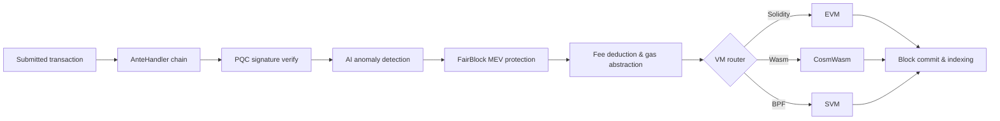

# Mimari Genel Bakış

QoreChain; üç ana süreçten — zincir düğümü, AI sidecar ve blok dizinleyici (indexer) — oluşan, bir Postgres veritabanıyla desteklenen ve Prometheus ile Grafana aracılığıyla izlenen modüler bir blok zinciri düğümüdür. Ana ağ (`qorechain-vladi`, EVM chain ID **9801**), zincir sürümü **v3.1.77** üzerinde 7 Haziran 2026'dan beri yayında; paralel bir test ağı (`qorechain-diana`, EVM chain ID **9800**) da çalışmaktadır. Zincir, Cosmos SDK v0.53 üzerine kuruludur. Aşağıdaki şema, üst düzey bileşen yerleşimini göstermektedir.

Aşağıdaki işlem yaşam döngüsü, gönderilen bir işlemin düğüm boyunca nasıl aktığını özetler — AnteHandler dekoratör zincirinden (güvenlik ve ücret kontrolleri) VM yürütmesine ve zincir üzerinde nihai uzlaşıya kadar:



```
┌────────────────────────────────────────────────────────────────────────────┐
│                            QoreChain Node                                  │
│                                                                            │
│  ┌──────────────────── Virtual Machines ──────────────────────┐           │
│  │  ┌───────┐    ┌──────────┐    ┌───────┐                   │           │
│  │  │  EVM  │    │ CosmWasm │    │  SVM  │                   │           │
│  │  │(Sol.) │◄──►│ (Wasm)   │◄──►│ (BPF) │                   │           │
│  │  └───┬───┘    └────┬─────┘    └───┬───┘                   │           │
│  │      └─────────┬───┘──────────────┘                       │           │
│  │           x/crossvm (bridge)                               │           │
│  └────────────────────────────────────────────────────────────┘           │
│                                                                            │
│  ┌────────────────────── Tokenomics ─────────────────────────┐           │
│  │  ┌──────┐   ┌───────┐   ┌───────────┐                    │           │
│  │  │x/burn│   │x/xqore│   │x/inflation│                    │           │
│  │  │10 ch.│   │lock/  │   │finite     │                    │           │
│  │  │37/30/│   │unlock │   │emission   │                    │           │
│  │  │20/10/│   │PvP    │   │590M       │                    │           │
│  │  │3     │   │       │   │budget     │                    │           │
│  │  └──────┘   └───────┘   └───────────┘                    │           │
│  └────────────────────────────────────────────────────────────┘           │
│                                                                            │
│  ┌──────────── IBC / Bridges ────────────────────────────────┐           │
│  │  ┌──────────┐  ┌──────────┐  ┌───────────┐  ┌──────────┐ │           │
│  │  │x/bridge  │  │x/babylon │  │x/abstract │  │x/gas     │ │           │
│  │  │37 QCB +  │  │BTC re-   │  │ account   │  │abstract. │ │           │
│  │  │8 IBC     │  │staking   │  │session key│  │multi-tok │ │           │
│  │  └────┬─────┘  └────┬─────┘  └───────────┘  └──────────┘ │           │
│  │  QCB Bridge     Babylon IBC   ERC-4337-like   ibc/USDC    │           │
│  │  PQC-signed     BTC finality  social recov.   ibc/ATOM    │           │
│  │  36 ext chains  checkpoint    spending rules  fee convert  │           │
│  │  ┌──────────┐                                              │           │
│  │  │x/fair    │  5-Lane Prioritization: PQC|MEV|AI|Def|Free │           │
│  │  │ block    │  tIBE encrypted mempool framework           │           │
│  │  └──────────┘                                              │           │
│  └────────────────────────────────────────────────────────────┘           │
│                                                                            │
│  ┌──── Rollup Development Kit ───────────────────────────────┐           │
│  │  ┌──────────┐  ┌──────────┐  ┌───────────┐  ┌──────────┐ │           │
│  │  │ x/rdk    │  │Settlement│  │ DA Router │  │ Profiles │ │           │
│  │  │ 4 modes: │  │Optimistic│  │ Native    │  │ defi     │ │           │
│  │  │ opt/zk/  │  │ZK/Based/ │  │ Celestia* │  │ gaming   │ │           │
│  │  │ based/   │  │Sovereign │  │ Both      │  │ nft      │ │           │
│  │  │ sovereign│  │          │  │           │  │ social/  │ │           │
│  │  │          │  │          │  │           │  │ general  │ │           │
│  │  └────┬─────┘  └────┬─────┘  └───────────┘  └──────────┘ │           │
│  │  Bank escrow    Auto-finalize  SHA-256 commit  AI-assisted │           │
│  │  Burn on create EndBlocker     Blob pruning    PRISM sugg. │           │
│  │  → x/multilayer (RegisterSidechain + AnchorState)          │           │
│  └────────────────────────────────────────────────────────────┘           │
│                                                                            │
│  ┌──────────────┐ ┌──────┐ ┌────────────┐ ┌─────┐                       │
│  │x/rlconsensus │ │ x/ai │ │x/reputation│ │x/qca│                       │
│  │  PRISM (RL)  │ │      │ │            │ │     │                       │
│  └──────┬───────┘ └──┬───┘ └────┬──────┘ └──┬──┘                       │
│   PPO MLP         AI Engine   Scoring    CPoS Pools                      │
│   Obs/Action      Fraud Det.  Decay      Bonding                         │
│   Circuit Brk     Fee Opt.    Sigmoid    Slashing                        │
│   Rollup Adv.     TEE/FL                 QDRW Gov                        │
│                                                                            │
│  ┌──────┐ ┌──────────┐                                                   │
│  │x/pqc │ │ x/multi  │                                                   │
│  └──┬───┘ └────┬─────┘                                                   │
│  Dilithium    Layer Router                                                │
│  ML-KEM       Sidechains                                                  │
│  Hybrid Sig   + Rollups                                                   │
│  SHAKE-256                                                                │
│                                                                            │
│  ┌──────┐ ┌───────┐                                                      │
│  │x/svm │ │x/cross│                                                      │
│  └──┬───┘ └───┬───┘                                                      │
│  BPF Exec   CrossVM Msg                                                   │
└────────┬──────┬───────────────────────────────────────┬───────────────────┘
         │      │                                       │
   ┌─────┴─────┐│                              ┌───────┴──────┐
   │libqorepqc ││                              │  Indexer     │
   │(Rust PQC) ││                              │  (Postgres)  │
   └───────────┘│                              └──────────────┘
   ┌───────────┐│  ┌──────────┐
   │libqoresvm ││  │AI Sidecar│
   │(Rust BPF) │└──│ (gRPC)   │
   └───────────┘   └──────────┘
```

## Düğüm Bileşenleri

QoreChain, her biri kendi Go modülüne ve ikili dosyasına sahip üç işbirlikçi süreç olarak çalışır:

| Bileşen            | Açıklama                                                                                                                                                                                                                                                                                                                            | Konum                     |
| ------------------ | -------------------------------------------------------------------------------------------------------------------------------------------------------------------------------------------------------------------------------------------------------------------------------------------------------------------------------------- | ------------------------- |
| **qorechain-node** | Çekirdek blok zinciri düğümü. QoreChain Uzlaşı Motorunu (Consensus Engine) çalıştırır, tüm özel modülleri yürütür, üç VM çalışma zamanını da yönetir ve RPC, REST, gRPC ile JSON-RPC uç noktalarını sunar.                                                                                                                            | `qorechain-core/`         |
| **ai-sidecar**     | QCAI Backend tarafından desteklenen gelişmiş AI çıkarımı (inference) yetenekleri sağlayan bir gRPC hizmeti. Sidecar; doğal dil analizi ve karmaşık örüntü tanıma gibi, zincir üzerindeki RL aracısının kapsamını aşan çıkarım isteklerini işler. Düğümle 50051 portu üzerinden gRPC ile iletişim kurar. | `qorechain-core/sidecar/` |
| **block-indexer**  | Düğümün RPC uç noktasından yeni bloklara ve işlemlere abone olan, olayları (events) ayrıştıran ve gezginler (explorers) ile API'ler tarafından hızlı sorgulama için yapılandırılmış verileri bir Postgres veritabanına yazan bir WebSocket dinleyicisidir.                                                                          | `qorechain-core/indexer/` |

## Portlar

| Port  | Protokol       | Hizmet                                                                            |
| ----- | -------------- | --------------------------------------------------------------------------------- |
| 26657 | HTTP/WebSocket | QoreChain Uzlaşı Motoru RPC (bloklar, işlemler, uzlaşı durumu)                     |
| 1317  | HTTP           | REST API (sorgu uç noktaları, işlem yayını)                                        |
| 9090  | gRPC           | gRPC sorgu ve işlem uç noktaları                                                   |
| 8545  | HTTP           | EVM JSON-RPC (`eth_`, `web3_`, `net_`, `txpool_`, `qor_` ad alanları)             |
| 8546  | WebSocket      | EVM JSON-RPC (WebSocket abonelikleri)                                             |
| 8899  | HTTP           | SVM JSON-RPC (Solana uyumlu: `getAccountInfo`, `getBalance`, `getSlot`, vb.)       |
| 50051 | gRPC           | AI Sidecar (düğümden gelen çıkarım istekleri)                                      |
| 5432  | TCP            | Postgres (blok dizinleyici depolaması)                                            |
| 9091  | HTTP           | Prometheus metrikleri                                                              |
| 3000  | HTTP           | Grafana panoları                                                                   |

## Modül Haritası

QoreChain, işleve göre gruplandırılmış olarak **20'den fazla özel modül dahil 45'ten fazla genesis modülü** kaydeder:

**Güvenlik**

* `x/pqc` — Kuantum sonrası kriptografi: Dilithium-5, ML-KEM-1024, hibrit secp256k1 (ECDSA) + ML-DSA-87, SHAKE-256, algoritma çevikliği

**AI ve Makine Öğrenmesi**

* `x/ai` — İşlem yönlendirme, anomali tespiti, dolandırıcılık tespiti, ücret optimizasyonu, TEE doğrulaması (attestation), federe öğrenme
* `x/reputation` — Zamansal sönümlemeli çok faktörlü doğrulayıcı itibar puanlaması
* `x/rlconsensus` — Zincir üzeri RL aracısı (PPO MLP), dinamik uzlaşı ayarı, devre kesici, rollup danışmanlığı — PRISM optimizasyon katmanı

**Uzlaşı**

* `x/qca` — QoreChain Uzlaşı Motoru üzerinde Üçlü Havuz Bileşik PoS (RPoS/DPoS/PoS), özel bağ eğrisi (bonding curve), kademeli kesinti (slashing), QDRW yönetişimi

**Sanal Makineler**

* `x/vm` — VM yönlendirme ve yaşam döngüsü yönetimi
* `x/svm` — SVM çalışma zamanı: BPF dağıtımı/yürütmesi, kira toplama, Solana uyumlu RPC
* `x/crossvm` — VM'ler arası iletişim: EVM-CosmWasm precompile + SVM asenkron olayları

**Tokenomik ve Likidite**

* `x/burn` — 10 yakım kanalı, EndBlocker ücret dağıtımı (37/30/20/10/3 bölüşümü)
* `x/xqore` — Yönetişimle güçlendirilmiş stake: kilitle/aç, kademeli çıkış cezaları, PvP yeniden tabanlama (rebase)
* `x/inflation` — Çok yıllı bir takvimde sonlu bir stake ödülü bütçesinden sabit arzlı emisyon
* `x/amm` — Zincir üzeri likidite / otomatik piyasa yapıcı

**Köprüler ve Birlikte Çalışabilirlik**

* `x/bridge` — Her büyük zincir türü genelinde 37 QCB yapılandırması (36 harici zincir + QoreChain geri döngüsü), PQC imzalı doğrulamalar (attestations), devre kesiciler
* `x/babylon` — Babylon Protocol aracılığıyla BTC yeniden stake etme (restaking), dönem (epoch) kontrol noktaları
* `x/multilayer` — Yan zincir/ödeme zinciri/rollup katman yönetimi, durum sabitleme (state anchoring)

**Yönetişim ve Lisanslama Uzantıları**

* `x/abstractaccount` — Akıllı hesaplar: çoklu imza (multisig), sosyal kurtarma, oturum anahtarları, harcama kuralları
* `x/fairblock` — MEV koruması: eşikli IBE şifreli mempool çerçevesi
* `x/gasabstraction` — Çoklu token gaz ödemesi: ibc/USDC, ibc/ATOM ücret dönüşümü
* `x/license` — Zincir lisanslama

**Rollup'lar**

* `x/rdk` — Rollup Development Kit: 4 uzlaşı modu (optimistic, zk, based, sovereign), hazır profiller, yerel DA, banka emaneti (escrow)

## AnteHandler Zinciri

Her işlem, yürütmeden önce aşağıdaki dekoratör zincirinden geçer. Dekoratörler sırayla çalışır; herhangi bir dekoratör işlemi reddedebilir.

```
SetUpContext
  → CircuitBreaker
    → PQCVerify
      → PQCHybridVerify
        → AIAnomaly
          → FairBlock
            → SVMComputeBudget
              → SVMDeductFee
                → Extension
                  → ValidateBasic
                    → TxTimeout
                      → Memo
                        → MinGasPrice
                          → ConsumeTxSize
                            → GasAbstraction
                              → DeductFee
                                → SetPubKey
                                  → ValidateSigCount
                                    → SigGasConsume
                                      → SigVerify
                                        → IncrementSequence
```

Anahtar dekoratörler aşağıdaki sırayla çalışır (her dekoratör sırayla çalışır ve bir işlemi reddedebilir):

1. **PQCVerify** — Modül `x/pqc`. PQC işaretli işlemlerdeki Dilithium-5 imzalarını doğrular.
2. **PQCHybridVerify** — Modül `x/pqc`. İkili secp256k1 (ECDSA) + ML-DSA-87 hibrit imzalarını doğrular.
3. **AIAnomaly** — Modül `x/ai`. İzolasyon ormanı anomali tespiti ve risk puanlaması çalıştırır.
4. **FairBlock** — Modül `x/fairblock`. MEV koruması için tIBE şifreli işlemleri işler.
5. **SVMComputeBudget** — Modül `x/svm`. SVM programları için hesaplama birimlerini doğrular ve tahsis eder.
6. **SVMDeductFee** — Modül `x/svm`. SVM'ye özgü yürütme ücretlerini düşer.
7. **GasAbstraction** — Modül `x/gasabstraction`. Düşmeden önce yerel olmayan ücret tokenlarını (USDC, ATOM) dönüştürür.

## Docker Compose Yığını

Tam geliştirme yığını, paylaşılan bir köprü ağında (`qorechain-net`) altı hizmetli bir Docker Compose dağıtımı olarak çalışır:

| Hizmet           | İmaj                       | Amaç                                                |
| ---------------- | -------------------------- | --------------------------------------------------- |
| `qorechain-node` | `qorechain-core:latest`    | Tüm modüller, VM'ler ve RPC uç noktalarıyla zincir düğümü |
| `ai-sidecar`     | `qorechain-sidecar:latest` | AI çıkarım hizmeti (gRPC + QCAI Backend)            |
| `block-indexer`  | `qorechain-indexer:latest` | Blok/işlem dizinleyici (WebSocket + Postgres)       |
| `postgres`       | `postgres:16-alpine`       | Blok dizinleyici için veritabanı                    |
| `prometheus`     | `prom/prometheus:latest`   | Metrik toplama ve depolama                          |
| `grafana`        | `grafana/grafana:latest`   | İzleme panoları ve uyarı verme                      |

Tam yığını başlatın:

```bash
docker compose up -d
```

Tüm kalıcı veriler adlandırılmış Docker birimlerinde saklanır: `node-data`, `postgres-data`, `prometheus-data` ve `grafana-data`.

## İlgili

* [Çok Katmanlı Mimari](/architecture/multilayer-architecture) — yan zincir kaydı ve durum sabitleme.
* [Uzlaşı Mekanizması](/architecture/consensus-mechanism) — blok üretimi, kesinlik ve kesinti (slashing).
* [PRISM Uzlaşı Motoru](/architecture/prism-consensus-engine) — AI güdümlü parametre optimizasyonu.
* [Kuantum Sonrası Güvenlik](/architecture/post-quantum-security) — yığın genelinde Dilithium-5 imzaları.
