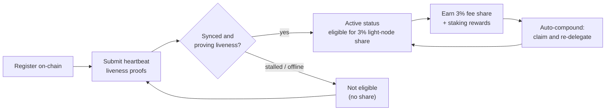

# Ödüller ve İzleme

Bir hafif düğüm hem **ödül kazanır** hem de bunları kazanmaya devam etmek için **sağlıklı kalması gerekir**. Bu sayfa, %3 hafif düğüm ödül payını, delege edilmiş stake ve otomatik bileşiklendirmenin nasıl çalıştığını ve düğümün nasıl izleneceğini kapsar.

## %3 blok ödül payı

QoreChain'in ücret dağıtımı, ağ verilerini sunan **hafif düğümler için sabit bir %3 pay** ayırır. Bu, protokolün ödül bölüşümündeki beş hedeften biridir — doğrulayıcılar (%37), yakılan (%30), hazine (%20), stake edenler (%10) ve **hafif düğümler (%3)** — ve zincir üzerinde uygulanır. Tam ayrıntı için [Tokenomik](/architecture/tokenomics) bölümüne bakın.

Bu paya hak kazanmak için bir düğümün **zincir üzerinde kayıtlı olması ve kalp atışı kanıtları aracılığıyla canlılığı etkin biçimde kanıtlaması** gerekir. Kayıtlı ancak çevrimdışı olan bir düğüm bu payı kazanmaz. Kayıt ve kalp atışlarının nasıl çalıştığını öğrenmek için [Kayıt ve Lisanslama](/light-node/registration-and-licensing) bölümüne bakın.

*Ödül uygunluğu: zincir üzerinde kaydolun, etkin duruma ulaşmak için kalp atışlarıyla canlılığı kanıtlayın, %3 payı kazanın, ardından bunu otomatik olarak stake'e bileşiklendirin.*



## Ödüller nasıl çalışır

Hafif düğüm payının ötesinde, düğüm delege edilmiş stake'i ve onun ürettiği staking ödüllerini yönetir. Davranış, `config.toml` dosyasının `[delegation]` bölümüyle yönlendirilir.

### Çoklu doğrulayıcı bölünmesiyle delege stake

Stake'i tek bir doğrulayıcıda yoğunlaştırmak yerine **birden çok doğrulayıcıya** delege edebilirsiniz. Düğüm, her delegasyonu ve her doğrulayıcıya atanan stake payını yapılandırılabilir **bölünme ağırlıkları** kullanarak izler; böylece riski set genelinde dağıtabilirsiniz.

### Ödülleri otomatik bileşiklendirme

Düğüm, yapılandırılabilir bir aralıkta **ödülleri talep edip bunları otomatik olarak yeniden delege edebilir**. Otomatik bileşiklendirme varsayılan olarak `1h` aralığında etkindir ve bir talep tetiklenmeden önce birikmesi gereken minimum bir ödül eşiği (`uqor` cinsinden) vardır. Bileşiklendirme, kazanılan ödülleri manuel müdahale olmadan ek stake'e dönüştürür.

### İtibar farkındalıklı yeniden dengeleme

Yeniden dengeleme etkinleştirildiğinde, düğüm yapılandırılabilir bir minimum itibar puanına tabi olarak **delegasyonu daha yüksek itibarlı doğrulayıcılara doğru otomatik olarak kaydırabilir**. Bu, stake'i bozulmuş doğrulayıcılarda bırakmak yerine iyi performans gösteren doğrulayıcılarda çalışır tutar.

### Ödülleri ve delegasyonları inceleme

SX sürümü, bu durumu incelemek için komutlar sunar:

```bash
lightnode-sx delegation   # current delegations and their split
lightnode-sx rewards      # pending staking rewards (uqor)
lightnode-sx validators   # the bonded validator set
```

UX sürümünde, **Delegation** görünümü aynı delegasyon ve ödül bilgilerini tarayıcıda gösterir.

## İzleme

Düğümü sağlıklı tutmak, onun ödüllere hak kazanmaya devam etmesini sağlar. İzlemeye değer üç şey vardır.

### Telemetri

Gerçek zamanlı telemetri doğrulayıcıları, mutabakat/ağı, köprüyü ve tokenomiği kapsar; her biri kendi aralığında yenilenir (`config.toml` içinde `[telemetry]` altında yapılandırılır). CLI'den:

```bash
lightnode-sx status    # node and light-client sync status
lightnode-sx network   # recent synced headers and latest height
```

UX sürümü aynı verileri **Overview**, **Network**, **Bridge** ve **Tokenomics** görünümleri genelinde canlı olarak yüzeye çıkarır — bkz. [UX Sürümü](/light-node/ux-edition).

### Eşitleme ve kalp atışı sağlığı

`status` komutu zincir kimliğini, en son blok yüksekliğini, zincirin yetişip yetişmediğini ve hafif istemcinin eşitlenmiş yüksekliğini ve eşitleme durumunu raporlar. Kayıtlı, eşitlenmiş ve çalışan bir düğüm **kalp atışı canlılık kanıtları** göndermeye devam eder ve böylece ödül payına hak kazanmayı sürdürür. Bu kalp atışları, zincirin PQC-gerektiren varsayılanıyla tutarlı olarak bir **PQC ile birlikte imzalanmış işlem hattı** (hibrit Dilithium-5 / ML-DSA-87) aracılığıyla üretilir — işlem hattının nasıl çalıştığını ve zincir üzerinde kalp atışlarını nasıl etkinleştireceğinizi öğrenmek için [Kayıt ve Lisanslama](/light-node/registration-and-licensing#pqc-cosigned-heartbeat-pipeline) bölümüne bakın. Eğer `status`, düğümün takıldığını veya eşitlenmediğini gösteriyorsa, canlılığı kanıtlamada başarısız oluyor olabilir — hak kazanma durumu etkilenmeden önce araştırın.

### Kendi kendine test sağlığı

Kriptografik yığında bir sorun olduğundan şüpheleniyorsanız, PQC kendi kendine testini istediğiniz zaman çalıştırın:

```bash
lightnode-sx selftest
```

Bu, keygen → imzalama → doğrulama → kurcalama tespiti (beş kontrol) çalıştırır ve herhangi bir hatada sıfırdan farklı çıkar. Bu, düğüm sorunlarını tanılarken bozuk veya eksik bir `libqorepqc` kitaplığını ekarte etmenin en hızlı yoludur. Tam kendi kendine test dökümü için [SX Sürümü](/light-node/sx-edition) bölümüne bakın.

## Sonraki adımlar

- [Kayıt ve Lisanslama](/light-node/registration-and-licensing) — kaydolun ve canlı kalın.
- [Tokenomik](/architecture/tokenomics) — tam ödül ve yakma modeli.
