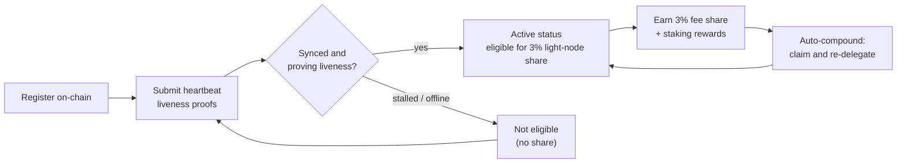

# Ödüller ve İzleme

Bir hafif node hem **ödül kazanır** hem de bu ödülleri kazanmaya devam edebilmek için **sağlıklı kalması gerekir**. Bu sayfa %3'lük hafif-node ödül payını, delege edilmiş stake'in ve otomatik bileşiklemenin nasıl çalıştığını ve node'un nasıl izleneceğini ele alır.

## %3 blok-ödülü payı

QoreChain'in ücret dağıtımı, ağ verisi sunan hafif node'lar için sabit bir **%3 pay** ayırır. Bu, protokolün ödül dağılımındaki beş hedeften biridir — validatörler (%37), yakılan (%30), hazine (%20), staker'lar (%10) ve **hafif node'lar (%3)** — ve zincir üzerinde uygulanır. Tam döküm için bkz. [Tokenomics](/architecture/tokenomics).

Bu paya hak kazanmak için bir node'un, kendi beyanına değil zincir üzerindeki kontrole dayanan üç şeye ihtiyacı vardır: aktif bir `lightnode_operator` lisansı, minimum **1.000 QOR delege edilmiş stake** — delege ettiğiniz tüm validatörler genelindeki toplamınız olarak sayılır, validatör başına değil — ve zincir üzerinde **1 QOR**'luk bir kayıt ücreti. Katılım ayrıca ağ genelinde **10.000 hafif node** ile sınırlandırılmıştır. Kayıt ve lisanslamanın nasıl işlediğine, ödül programına kayıt sürecinin güncel durumu da dahil olmak üzere, [Kayıt ve Lisanslama](/light-node/registration-and-licensing) sayfasından bakabilirsiniz.

Kayıt ve delegasyon tamamlandıktan sonra, uygun kalmak canlı kalmakla ilgili bir meseledir. Bir node'un en az **%80 çalışma süresine (uptime)** sahip olması ve yaklaşık **1.000 blokluk (~39 dakika) bir aralıkta** heartbeat canlılık kanıtları göndermeye devam etmesi gerekir; kaçırılan bir heartbeat'ten sonra node etkin değil olarak işaretlenmeden önce **~100 bloktan (~4 dakika)** oluşan bir tolerans süresi vardır. Etkin değil olarak işaretlenen bir node, canlılığını yeniden kanıtlayana kadar bu paydan kazanmayı durdurur.

*Ödül uygunluğu: aktif bir zincir üzerindeki lisansı ve minimum delege edilmiş stake'i elinde tutmak, kayıt olmak, ardından payın akmaya devam etmesini sağlayan uptime ve heartbeat-aralığı eşiklerinin üzerinde kalmak için heartbeat'ler aracılığıyla canlılığı kanıtlamaya devam etmektir.*


```mermaid
flowchart LR
    A["Register on-chain"] --> B["Submit heartbeat<br/>liveness proofs"]
    B --> C{"Synced and<br/>proving liveness?"}
    C -- "yes" --> D["Active status<br/>eligible for 3% light-node share"]
    C -- "stalled / offline" --> E["Not eligible<br/>(no share)"]
    E --> B
    D --> F["Earn 3% fee share<br/>+ staking rewards"]
    F --> G["Auto-compound:<br/>claim and re-delegate"]
    G --> D
```

## Ödüller nasıl işler

Hafif-node payının ötesinde, node delege edilmiş stake'i ve bunun ürettiği staking ödüllerini de yönetir. Bu davranış, `config.toml` dosyasının `[delegation]` bölümü tarafından yönlendirilir.

### Çoklu-validatör dağılımıyla delege edilmiş staking

Stake'i tek bir validatörde yoğunlaştırmak yerine **birden fazla validatöre** delege edebilirsiniz. Node, her delegasyonu ve her validatöre atanan stake payını yapılandırılabilir **bölüştürme ağırlıkları (split weights)** kullanarak takip eder, böylece riski küme genelinde dağıtabilirsiniz.

### Otomatik bileşikleme (auto-compound) ödülleri

Node, yapılandırılabilir bir aralıkta **ödülleri talep edip otomatik olarak yeniden delege edebilir**. Varsayılan olarak otomatik bileşikleme `1h` aralığıyla etkindir ve bir talebin tetiklenmesi için birikmesi gereken minimum bir ödül eşiği (`uqor` cinsinden) vardır. Bileşikleme, kazanılan ödülleri manuel müdahale olmadan ek stake'e dönüştürür.

### İtibar farkındalıklı yeniden dengeleme

Yeniden dengeleme etkinleştirildiğinde, node yapılandırılabilir bir minimum itibar puanına tabi olarak delegasyonu **daha yüksek itibarlı validatörlere doğru otomatik olarak kaydırabilir**. Bu, stake'in performansı düşen validatörlerde bırakılmak yerine iyi performans gösteren validatörlerle çalışmaya devam etmesini sağlar.

### Ödülleri ve delegasyonları inceleme

SX sürümü bu durumu incelemek için komutlar sunar:

```bash
lightnode-sx delegation   # current delegations and their split
lightnode-sx rewards      # pending staking rewards (uqor)
lightnode-sx validators   # the bonded validator set
```

UX sürümünde, **Delegation** görünümü aynı delegasyon ve ödül bilgisini tarayıcıda gösterir.

## İzleme

Node'u sağlıklı tutmak, onu ödüllere uygun tutan şeydir. İzlenmeye değer üç şey vardır.

### Telemetri

Gerçek zamanlı telemetri; validatörleri, konsensüsü/ağı, köprüyü ve tokenomiği kapsar; her biri kendi aralığında yenilenir (`config.toml` içindeki `[telemetry]` altında yapılandırılır). CLI üzerinden:

```bash
lightnode-sx status    # node and light-client sync status
lightnode-sx network   # recent synced headers and latest height
```

UX sürümü aynı veriyi **Overview**, **Network**, **Bridge** ve **Tokenomics** görünümlerinde canlı olarak sunar — bkz. [UX Edition](/light-node/ux-edition).

### Senkronizasyon ve heartbeat sağlığı

`status` komutu zincir kimliğini, en son blok yüksekliğini, zincirin yetişip yetişmediğini ve hafif istemcinin senkronize olduğu yüksekliği ile senkronizasyon durumunu bildirir. Kayıtlı, senkronize ve çalışan bir node, **heartbeat canlılık kanıtları** göndermeye devam eder ve böylece ödül payına uygun kalır. Bu heartbeat'ler, zincirin varsayılan olarak PQC gerektirmesiyle tutarlı biçimde bir **PQC-eş-imzalı (PQC-cosigned) işlem hattı** (hibrit Dilithium-5 / ML-DSA-87) aracılığıyla üretilir — hattın nasıl çalıştığı ve zincir üzerinde heartbeat'lerin nasıl etkinleştirileceği için bkz. [Kayıt ve Lisanslama](/light-node/registration-and-licensing#pqc-cosigned-heartbeat-pipeline). `status` node'un takıldığını veya senkronize olmadığını gösteriyorsa, canlılığını kanıtlamakta başarısız olabilir — uygunluk etkilenmeden önce araştırın.

### Öz-test sağlığı

Kriptografik yığında bir sorundan şüpheleniyorsanız, PQC öz-testini istediğiniz zaman çalıştırabilirsiniz:

```bash
lightnode-sx selftest
```

Bu, anahtar üretimi → imzalama → doğrulama → kurcalama tespiti (beş kontrol) sırasını çalıştırır ve herhangi bir başarısızlıkta sıfırdan farklı bir kodla çıkar. Bu, node sorunlarını teşhis ederken post-kuantum imzalama yığınındaki bir sorunu ekarte etmenin en hızlı yoludur. Tam öz-test dökümü için bkz. [SX Edition](/light-node/sx-edition).

## Sırada ne var

- [Kayıt ve Lisanslama](/light-node/registration-and-licensing) — kayıt olun ve canlı kalın.
- [Tokenomics](/architecture/tokenomics) — tam ödül ve yakma modeli.
