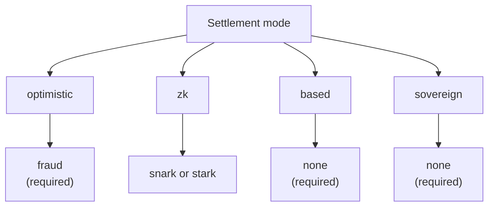

# Rollup'lara Genel Bakış

QoreChain **Rollup Geliştirme Kiti (RDK)** — `x/rdk` modülü — geliştiricilerin QoreChain üzerinde uzlaşan (settle olan) uygulamaya özel rollup'lar başlatmasını sağlar. Her rollup, kendi blok süresine, sanal makinesine, ücret modeline ve sıralamasına sahip bağımsız bir yürütme ortamıdır; aynı zamanda QoreChain'in güvenlik, kuantum sonrası kriptografi ve veri erişilebilirliği garantilerini devralır.

:::caution
RDK ve rollup uzlaşma katmanı aktif olarak gelişen bir yetenektir. Bu bölümde anlatılan uzlaşma modlarını, kanıt sistemlerini, ön ayarları ve özellik bazlı olgunluğu değişikliğe tabi tasarım niyeti olarak değerlendirin ve ana ağı (**`qorechain-vladi`**, EVM zincir kimliği **9801**, zincir sürümü **v3.1.77**) hedeflemeden önce herhangi bir dağıtımı **`qorechain-diana`** test ağında doğrulayın.
:::

Daha düşük seviyeli modül referansı için — modül parametreleri, yaşam döngüsü iç işleyişi, burn entegrasyonu ve çok katmanlı çapalama (anchoring) — Mimari bölümündeki **[Rollup Geliştirme Kiti](/architecture/rollup-development-kit)** sayfasına bakın. Bu Rollup'lar bölümü, geliştiriciye yönelik nasıl yapılır kılavuzudur: RDK'nın ne olduğu, hangi paradigmanın seçileceği, nasıl dağıtılacağı, veri erişilebilirliğinin nasıl çalıştığı ve para çekme işlemlerinin L2'den L1'e nasıl uzlaştığı.

---

## RDK size ne sağlar

RDK aracılığıyla oluşturulan bir rollup, yapılandırılabilir dört konuyu bir araya getirir:

| Konu | Neyi kontrol eder | Seçenekler |
| ------- | ---------------- | ------- |
| **Uzlaşma modu** | Rollup'un durum geçişlerinin QoreChain üzerinde nasıl doğrulanıp kesinleştirileceği | `optimistic`, `zk`, `based`, `sovereign` |
| **Kanıt sistemi** | Uzlaşmayı destekleyen kriptografik veya ekonomik mekanizma | `fraud`, `snark`, `stark`, `none` |
| **Sıralayıcı modu** | İşlemleri uzlaşmadan önce kimin sıraladığı | `dedicated`, `shared`, `based` |
| **Veri erişilebilirliği** | İşlem verilerinin, herkesin durumu yeniden oluşturabilmesi için nerede yayınlandığı | `native`, `celestia`, `both` |

Her rollup, benzersiz bir `rollup-id` ile kaydedilir, QOR cinsinden bir stake bonosu ile desteklenir ve bir yaşam döngüsü durumu (`pending`, `active`, `paused`, `stopped`) atanır. Tam oluşturma ve yaşam döngüsü akışı için **[Bir Rollup Dağıtma](/rollups/deploying-a-rollup)** sayfasına bakın.

---

## QoreChain RDK'yı farklı kılan nedir

Herhangi bir rollup kitinin temel özelliklerinin ötesinde, QoreChain RDK, QoreChain'in 1. Katmanına dayanan ve kuantum sonrası olmayan, yapay zeka temelli olmayan bir taban katmanı üzerine inşa edilmiş hiçbir kitin sunamayacağı üç yetenek sunar — ayrıca bir gözetleme kulesi (watchtower) otomatik itiraz mekanizması. RDK beş dilde (TypeScript, Python, Go, Rust, Java) gönderilir ve tümü şu anda **v0.4.0** sürümündedir.

| Ayırt edici özellik | Ne yapar |
| -------------- | ------------ |
| **[Kuantuma dayanıklı uzlaşma makbuzları](/rollups/settlement-receipts)** | Bir uzlaşma çapasını, kuantum sonrası (ML-DSA-87 / Dilithium-5) bir imza altında **tamamen çevrimdışı** doğrulanabilen taşınabilir bir makbuza dönüştürün — beş istemcinin tamamında bayt bayt aynı. |
| **[QCAI Rollup Yardımcı Pilotu](/rollups/qcai-copilot)** | QoreChain'in zincir üzerindeki YZ/RL hizmetlerini (ücret politikası ajanı, öneriler, dolandırıcılık soruşturmaları, devre kesiciler) tek bir rollup için salt okunur, sade dille bir tavsiyede toplayın. |
| **[Çoklu-VM VM'ler arası çağrılar](/rollups/multi-vm)** | VM'ler arası ön derleme (`0x…0901`) aracılığıyla bir EVM/Solidity rollup sözleşmesinden bir CosmWasm sözleşmesini çağırın. |
| **[Gözetleme Kulesi (Watchtower)](/rollups/watchtower)** | Yeni partileri ve itiraz penceresi son tarihlerini ortaya çıkaran ve geçersiz partilere geçerlilik yükleminize karşı itiraz eden, optimistik rollup'lar için bir otomatik itiraz çerçevesi. |

Tam gerekçe ve kod örnekleri için **[Neden QoreChain RDK](/rollups/why)** sayfasına bakın.

---

## Dört uzlaşma paradigması

QoreChain RDK, her biri farklı güven varsayımlarına, kesinlik özelliklerine ve kanıt gereksinimlerine sahip dört farklı uzlaşma modunu destekler. Uzlaşma modu ile kanıt sisteminin birleşimi zincir üzerinde doğrulanır — uyumsuz bir eşleşme oluşturma sırasında reddedilir. Aşağıdaki diyagram, her uzlaşma modunu geçerli kanıt sistemine eşler.

### Optimistic

Optimistik rollup'lar, gönderilen partilerin varsayılan olarak geçerli olduğunu varsayar ve anlaşmazlık çözümü için **dolandırıcılık kanıtlarına (fraud proofs)** dayanır.

* **Kanıt sistemi**: `fraud` — etkileşimli dolandırıcılık kanıtları
* **Sıralayıcı**: `dedicated` veya `shared`
* **Kesinlik**: Yapılandırılabilir bir itiraz penceresi başarılı bir itiraz olmadan sona erene kadar gecikir
* **Anlaşmazlıklar**: Herkes, pencere içinde gönderilen bir partiye karşı bir dolandırıcılık kanıtı itirazı sunabilir; başarılı bir itiraz partiyi reddeder

### ZK (Sıfır Bilgi)

ZK rollup'ları, her partiye, yeniden yürütme olmadan durum geçişinin doğruluğunu kanıtlayan kriptografik bir geçerlilik kanıtı ekler.

* **Kanıt sistemi**: `snark` (özlü kanıtlar) veya `stark` (şeffaf kanıtlar, güvenilir kurulum gerektirmez)
* **Sıralayıcı**: `dedicated` veya `shared`
* **Kesinlik**: Geçerli kanıt doğrulamasında — itiraz penceresi gerekmez
* **Olgunluk**: ZK ve STARK doğrulaması hâlâ olgunlaşıyor. ZK uzlaşmasını henüz üretime hazır olmayan bir özellik olarak değerlendirin ve test ağında doğrulayın. Ayrıntılar için **[ZK / STARK ve Para Çekme](/rollups/zk-stark-withdrawals)** sayfasına bakın.

### Based

Based rollup'lar, işlem sıralamasını QoreChain (L1) önericilerine devreder ve ana zincirin canlılığını ve sansüre karşı direncini devralır.

* **Kanıt sistemi**: `none` — L1 önericileri sıralama gerçeğinin kaynağıdır
* **Sıralayıcı**: `based` (gerekli — zincir üzerinde doğrulama ile zorunlu kılınır)
* **Kesinlik**: Ana zincir onayını takip eder
* **Ödünleşim**: QoreChain doğrulayıcıları sıralamayı yürüttüğü için en basit operasyonel model; ancak özel sıralayıcı gecikme kontrolü pahasına

### Sovereign

Sovereign rollup'lar kendi konsensüslerini çalıştırır ve kendi kendine sıralanır. Durumu doğrulanabilirlik için QoreChain'e çapalarlar, ancak kesinlik için ana zincire bağımlı değildirler.

* **Kanıt sistemi**: `none`
* **Sıralayıcı**: rollup tarafından kendi kendine yönetilir
* **Kesinlik**: Bağımsız — rollup'un kendi konsensüsü tarafından belirlenir
* **Durum çapalama**: Durum kökleri şeffaflık için QoreChain'e gönderilir, ancak ana zincir bunları zorunlu kılmaz

---

## Kanıt sistemi uyumluluğu

Uzlaşma modu, hangi kanıt sistemlerinin geçerli olduğunu kısıtlar. Bu eşleşmeler, bir rollup oluşturulduğunda zorunlu kılınır.

| Uzlaşma modu | `fraud` | `snark` | `stark` | `none` |
| --------------- | :-----: | :-----: | :-----: | :----: |
| **optimistic**  | Gerekli | — | — | — |
| **zk**          | — | Desteklenir | Desteklenir | — |
| **based**       | — | — | — | Gerekli |
| **sovereign**   | — | — | — | Gerekli |

---

## Sıralayıcı modları

Sıralayıcı, bir rollup bloğu içindeki işlemleri uzlaşmadan önce kimin sıralayacağını belirler.

| Mod | Kim sıralar | Notlar |
| ---- | ------------- | ----- |
| **`dedicated`** | Tek bir belirlenmiş operatör adresi | En düşük gecikme; canlılık ve adil sıralama için operatöre güven gerektirir |
| **`shared`** | Paylaşılan bir sıralayıcı kümesi | Sıralama küme genelinde dağıtılır; biraz daha yüksek koordinasyon yükü |
| **`based`** | QoreChain L1 önericileri | Ana zincir doğrulayıcı güvenliğini ve sansüre karşı direnci devralır; `based` uzlaşması için gereklidir |

---

## Bir paradigma seçme

| Şunu istiyorsanız... | Şunu değerlendirin |
| -------------- | -------- |
| QoreChain doğrulayıcılarının sıraladığı en basit operasyonel kurulum | **based** |
| Kriptografik garantilerle hızlı kesinlik (olgunlaşmakta) | **zk** (`snark` / `stark`) |
| Ekonomik anlaşmazlık çözümüne sahip iyi anlaşılmış bir model | **optimistic** (`fraud`) |
| Doğrulanabilirlik için çapalanmış, kendi konsensüsünüzle tam bağımsızlık | **sovereign** |

Nereden başlayacağınızdan emin değil misiniz? RDK, bu seçenekleri yaygın uygulama kategorileri için bir araya getiren **ön ayar profilleri** içerir — bkz. **[Ön Ayar Profilleri](/rollups/preset-profiles)** — ve kullanım senaryonuzun sade dilde bir açıklamasından bir profil öneren bir `suggest-profile` sorgusu sunar.

Geliştiriciler için RDK, ayrıca genel TypeScript SDK'sı **`@qorechain/rdk`** ve aynı zincir üzeri modülü koddan çalıştıran **`create-qorechain-rollup`** iskelet oluşturucu olarak da gönderilir — bkz. **[Bir Rollup Dağıtma](/rollups/deploying-a-rollup#deploy-with-the-typescript-rdk-qorechainrdk)**.

## İlgili

* [Bir Rollup Dağıtma](/rollups/deploying-a-rollup) — CLI'dan veya TypeScript RDK'dan bir rollup başlatın.
* [Ön Ayar Profilleri](/rollups/preset-profiles) — yaygın uygulama kategorileri için tek tıkla paketler.
* [Veri Erişilebilirliği](/rollups/data-availability) — yerel DA yönlendiricisi ve blob depolama.
* [ZK / STARK Para Çekme](/rollups/zk-stark-withdrawals) — kanıt destekli para çekme akışları.
