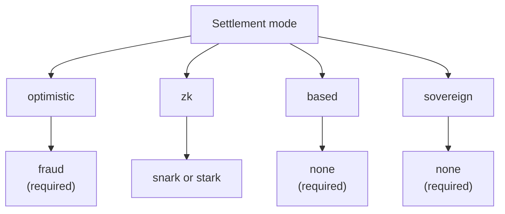

# Rollup'lara Genel Bakış

QoreChain **Rollup Development Kit (RDK)** — yani `x/rdk` modülü — geliştiricilerin QoreChain üzerinde mutabakata (settlement) ulaşan, uygulamaya özel rollup'lar başlatmasına olanak tanır. Her rollup; kendi blok süresi, sanal makinesi, ücret modeli ve sıralamasıyla (sequencing) bağımsız bir yürütme ortamıdır ve aynı zamanda QoreChain'in güvenliğini, post-kuantum kriptografisini ve veri erişilebilirliği (data availability) garantilerini devralır.

:::caution
RDK ve rollup mutabakat katmanı aktif olarak gelişmekte olan bir yetenektir. Bu bölümde anlatılan mutabakat modlarını, ispat sistemlerini, hazır profilleri ve özellik bazındaki olgunluk düzeylerini değişebilecek tasarım hedefleri olarak değerlendirin ve herhangi bir dağıtımı ana ağı (**`qorechain-vladi`**, EVM zincir kimliği **9801**, zincir sürümü **v3.1.85**) hedeflemeden önce **`qorechain-diana`** test ağında doğrulayın.
:::

Daha alt seviyedeki modül referansı — modül parametreleri, yaşam döngüsü iç işleyişi, yakım (burn) entegrasyonu ve çok katmanlı çapalama (multilayer anchoring) — için Mimari bölümündeki **[Rollup Development Kit](/architecture/rollup-development-kit)** sayfasına bakın. Bu Rollup'lar bölümü ise geliştiriciye dönük uygulama kılavuzudur: RDK nedir, hangi paradigma seçilmeli, dağıtım nasıl yapılır, veri erişilebilirliği nasıl çalışır ve para çekme işlemleri L2'den L1'e nasıl mutabık kılınır.

---

## RDK size ne sağlar

RDK ile oluşturulan bir rollup, dört yapılandırılabilir başlığı bir araya getirir:

| Başlık | Neyi kontrol eder | Seçenekler |
| ------- | ---------------- | ------- |
| **Mutabakat modu** | Rollup'ın durum geçişlerinin QoreChain üzerinde nasıl doğrulanıp kesinleştirileceğini | `optimistic`, `zk`, `based`, `sovereign` |
| **İspat sistemi** | Mutabakatı destekleyen kriptografik veya ekonomik mekanizmayı | `fraud`, `snark`, `stark`, `none` |
| **Sıralayıcı (sequencer) modu** | İşlemlerin mutabakattan önce kim tarafından sıralanacağını | `dedicated`, `shared`, `based` |
| **Veri erişilebilirliği** | Herkesin durumu yeniden oluşturabilmesi için işlem verilerinin nerede yayımlanacağını | `native`, `celestia`, `both` |

Her rollup benzersiz bir `rollup-id` ile kaydedilir, QOR cinsinden bir stake teminatıyla desteklenir ve bir yaşam döngüsü durumu (`pending`, `active`, `paused`, `stopped`) atanır. Oluşturma ve yaşam döngüsü akışının tamamı için **[Rollup Dağıtma](/rollups/deploying-a-rollup)** sayfasına bakın.

---

## QoreChain RDK'yı farklı kılan nedir

Herhangi bir rollup kitinin standart özelliklerinin ötesinde, QoreChain RDK; QoreChain'in Katman 1'ine bağlı olan ve post-kuantum olmayan, yapay zekâ içermeyen bir temel katman üzerine inşa edilmiş hiçbir kitin sunamayacağı üç yetenek — artı bir watchtower otomatik itiraz (auto-challenger) çerçevesi — sunar. RDK beş dilde (TypeScript, Python, Go, Rust, Java) yayımlanır ve npm, PyPI ile Maven Central üzerinde **v0.4.4** sürümüyle hizalanmıştır (crates.io üzerinde en son yayımlanan sürümü kurun veya depodan derleyin). v0.4.2'den itibaren `mainnet` ve `testnet` hazır profilleri, herkese açık `qore.host` uç noktalarını yerleşik olarak içerir; böylece `createRdkClient({ network })` hiçbir manuel uç nokta yapılandırması gerektirmeden zincire erişir.

| Farklılaştırıcı özellik | Ne yapar |
| -------------- | ------------ |
| **[Kuantuma dayanıklı mutabakat makbuzları](/rollups/settlement-receipts)** | Bir mutabakat çapasını, post-kuantum (ML-DSA-87 / Dilithium-5) imza altında **tamamen çevrimdışı** doğrulanabilen taşınabilir bir makbuza dönüştürür — beş istemcinin tümünde bayt bayt aynı olacak şekilde. |
| **[QCAI Rollup Copilot](/rollups/qcai-copilot)** | QoreChain'in zincir üstü AI/RL servislerini (ücret politikası ajanı, öneriler, dolandırıcılık soruşturmaları, devre kesiciler) tek bir rollup için salt okunur, sade dilde bir danışmanlık raporunda toplar. |
| **[Çoklu-VM çapraz-VM çağrıları](/rollups/multi-vm)** | Bir EVM/Solidity rollup sözleşmesinden, çapraz-VM ön derlemesi (`0x…0901`) aracılığıyla bir CosmWasm sözleşmesini çağırmanızı sağlar. |
| **[Watchtower](/rollups/watchtower)** | Optimistic rollup'lar için yeni batch'leri ve itiraz penceresi (challenge window) son tarihlerini ortaya çıkaran ve geçersiz batch'lere sizin geçerlilik yüklemenize (validity predicate) göre itiraz eden bir otomatik itiraz çerçevesi. |

Gerekçenin tamamı ve kod örnekleri için **[Neden QoreChain RDK](/rollups/why)** sayfasına bakın.

---

## Dört mutabakat paradigması

QoreChain RDK, her biri farklı güven varsayımlarına, kesinlik (finality) özelliklerine ve ispat gereksinimlerine sahip dört ayrı mutabakat modunu destekler. Mutabakat modu ile ispat sistemi kombinasyonu zincir üzerinde doğrulanır — uyumsuz bir eşleşme, oluşturma sırasında reddedilir. Aşağıdaki diyagram, her mutabakat modunu geçerli ispat sistemiyle eşler.

```mermaid
flowchart TD
    S["Settlement mode"]
    S --> O["optimistic"]
    S --> Z["zk"]
    S --> BA["based"]
    S --> SV["sovereign"]
    O --> OF["fraud<br/>(required)"]
    Z --> ZS["snark or stark"]
    BA --> BN["none<br/>(required)"]
    SV --> SN["none<br/>(required)"]
```

### Optimistic

Optimistic rollup'lar, gönderilen batch'lerin varsayılan olarak geçerli olduğunu kabul eder ve uyuşmazlık çözümü için **sahtecilik ispatlarına (fraud proofs)** dayanır.

* **İspat sistemi**: `fraud` — etkileşimli sahtecilik ispatları
* **Sıralayıcı**: `dedicated` veya `shared`
* **Kesinlik**: Yapılandırılabilir itiraz penceresi başarılı bir itiraz olmadan sona erene kadar gecikmelidir
* **Uyuşmazlıklar**: Pencere içinde herkes, gönderilmiş bir batch'e karşı sahtecilik ispatı itirazı sunabilir; başarılı bir itiraz batch'in reddedilmesine yol açar

### ZK (Sıfır Bilgi / Zero-Knowledge)

ZK rollup'lar her batch'e, durum geçişinin doğruluğunu yeniden yürütme olmadan kanıtlayan kriptografik bir geçerlilik ispatı ekler.

* **İspat sistemi**: `snark` (özlü ispatlar) veya `stark` (şeffaf ispatlar, güvenilir kurulum gerektirmez)
* **Sıralayıcı**: `dedicated` veya `shared`
* **Kesinlik**: Geçerli ispat doğrulandığında — itiraz penceresi gerekmez
* **Olgunluk**: ZK ve STARK doğrulaması hâlâ olgunlaşmaktadır. ZK mutabakatını henüz üretim düzeyinde sertleştirilmemiş kabul edin ve test ağında doğrulayın. Ayrıntılar için **[ZK / STARK ve Para Çekme](/rollups/zk-stark-withdrawals)** sayfasına bakın.

### Based

Based rollup'lar, işlem sıralamasını QoreChain (L1) önericilerine (proposers) devrederek ana zincirin canlılığını (liveness) ve sansüre direncini devralır.

* **İspat sistemi**: `none` — sıralama gerçeğinin kaynağı L1 önericileridir
* **Sıralayıcı**: `based` (zorunlu — zincir üstü doğrulamayla uygulanır)
* **Kesinlik**: Ana zincir onayını takip eder
* **Ödünleşim**: QoreChain doğrulayıcıları sıralamayı üstlendiği için en basit operasyonel model; karşılığında özel sıralayıcının sağladığı gecikme kontrolünden vazgeçilir

### Sovereign

Sovereign rollup'lar kendi konsensüslerini çalıştırır ve kendi kendilerini sıralarlar. Doğrulanabilirlik için durumlarını QoreChain'e çapalar, ancak kesinlik için ana zincire bağımlı değildirler.

* **İspat sistemi**: `none`
* **Sıralayıcı**: rollup tarafından kendi kendine yönetilir
* **Kesinlik**: Bağımsız — rollup'ın kendi konsensüsü tarafından belirlenir
* **Durum çapalama**: Durum kökleri (state roots) şeffaflık için QoreChain'e gönderilir, ancak ana zincir bunları zorunlu kılmaz

---

## İspat sistemi uyumluluğu

Mutabakat modu, hangi ispat sistemlerinin geçerli olduğunu kısıtlar. Bu eşleşmeler, rollup oluşturulurken zorunlu tutulur.

| Mutabakat modu | `fraud` | `snark` | `stark` | `none` |
| --------------- | :-----: | :-----: | :-----: | :----: |
| **optimistic**  | Zorunlu | — | — | — |
| **zk**          | — | Desteklenir | Desteklenir | — |
| **based**       | — | — | — | Zorunlu |
| **sovereign**   | — | — | — | Zorunlu |

---

## Sıralayıcı modları

Sıralayıcı, mutabakattan önce işlemlerin bir rollup bloğu içinde kim tarafından sıralanacağını belirler.

| Mod | Kim sıralar | Notlar |
| ---- | ------------- | ----- |
| **`dedicated`** | Tek bir belirlenmiş operatör adresi | En düşük gecikme; canlılık ve adil sıralama için operatöre güven gerektirir |
| **`shared`** | Paylaşımlı bir sıralayıcı kümesi | Sıralama küme genelinde dağıtılır; koordinasyon yükü biraz daha yüksektir |
| **`based`** | QoreChain L1 önericileri | Ana zincir doğrulayıcı güvenliğini ve sansüre direnci devralır; `based` mutabakatı için zorunludur |

---

## Paradigma seçimi

| Şunu istiyorsanız... | Şunu değerlendirin |
| -------------- | -------- |
| QoreChain doğrulayıcılarının sıraladığı en basit operasyonel kurulum | **based** |
| Kriptografik garantilerle hızlı kesinlik (olgunlaşmakta) | **zk** (`snark` / `stark`) |
| Ekonomik uyuşmazlık çözümüne sahip, iyi anlaşılmış bir model | **optimistic** (`fraud`) |
| Kendi konsensüsünüzle tam bağımsızlık, doğrulanabilirlik için çapalama | **sovereign** |

Nereden başlayacağınızdan emin değil misiniz? RDK, yaygın uygulama kategorileri için bu seçimleri paketleyen **hazır profiller** sunar — bkz. **[Hazır Profiller](/rollups/preset-profiles)** — ve kullanım senaryonuzun sade dilde bir açıklamasından profil öneren bir `suggest-profile` sorgusu içerir.

Geliştiriciler için RDK ayrıca herkese açık TypeScript SDK'sı **`@qorechain/rdk`** ve aynı zincir üstü modülü koddan yöneten **`create-qorechain-rollup`** iskele oluşturucusu olarak da yayımlanır — bkz. **[Rollup Dağıtma](/rollups/deploying-a-rollup#deploy-with-the-typescript-rdk-qorechainrdk)**.

## İlgili sayfalar

* [Rollup Dağıtma](/rollups/deploying-a-rollup) — CLI'dan veya TypeScript RDK'dan bir rollup başlatın.
* [Hazır Profiller](/rollups/preset-profiles) — yaygın uygulama kategorileri için tek tıkla kullanılabilen paketler.
* [Veri Erişilebilirliği](/rollups/data-availability) — yerleşik DA yönlendiricisi ve blob depolama.
* [ZK / STARK Para Çekme](/rollups/zk-stark-withdrawals) — ispat destekli para çekme akışları.
