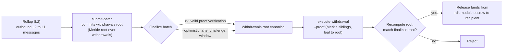

# ZK / STARK ve Para Çekme İşlemleri

Bu sayfa birbiriyle ilişkili iki konuyu kapsar: ZK ile çözümlenen (ZK-settled) rollup'lar tarafından kullanılan **ZK kanıt sistemleri** (`snark` ve `stark`) ve bir yığın (batch) sonuçlandırıldığında (finalized) fonları bir rollup'tan QoreChain'e geri taşıyan **L2 → L1 para çekme akışı**.

:::caution
ZK ve STARK doğrulaması, RDK'nın aktif olarak olgunlaşan bir parçasıdır. Burada açıklanan kanıt sistemlerini ve para çekme akışını tasarım niyeti olarak ele alın, **`qorechain-diana`** testnet'inde doğrulayın ve henüz mainnet'te üretim düzeyinde sağlamlaştırılmış (production-hardened) kriptografik garantiler varsaymayın.
:::

---

## ZK kanıt sistemleri

ZK ile çözümlenen bir rollup (`zk` çözüm modu), her çözüm yığınına bir geçerlilik kanıtı (validity proof) ekler ve rollup'ın işlemlerini yeniden çalıştırmadan durum geçişinin doğru olduğunu kanıtlar. ZK çözümü iki kanıt sistemini destekler:

| Kanıt sistemi | Özellikler |
| ------------ | --------------- |
| **`snark`** | Özlü (succinct) kanıtlar |
| **`stark`** | Şeffaf kanıtlar — güvenilir kurulum (trusted setup) yok |

`zk` çözüm modu, `snark` veya `stark`'tan birini gerektirir; eşleşme, rollup oluşturulduğunda zincir üstünde uygulanır. Buna karşılık, `optimistic` çözümü `fraud` kanıt sistemini kullanır ve `based` ile `sovereign` çözümü `none` kullanır. Tam uyumluluk matrisi için bkz. **[Rollup'lara Genel Bakış](/rollups/overview)**.

### Sonuçlandırma (Finality)

Bir hile-kanıtı (fraud-proof) itiraz penceresini bekleyen optimistic rollup'ların aksine, bir ZK yığını **geçerli kanıt doğrulamasıyla**, bir anlaşmazlık penceresi olmadan sonuçlandırılabilir. Bu, ZK çözümünün temel ödünleşimidir (trade-off): kanıt üretmenin maliyeti ve karmaşıklığı karşılığında daha güçlü, daha hızlı sonuçlandırma.

### Olgunluk

ZK ve STARK kanıt doğrulaması hâlâ olgunlaşmaktadır. ZK çözümünü **henüz üretim düzeyinde sağlamlaştırılmamış** olarak ele alın: prototip oluşturun ve testnet'te doğrulayın ve değer taşıyan mainnet rollup'ları için ona güvenmeden önce tam kanıt doğrulamasının durumu için RDK'nın sürüm notlarını takip edin.

---

## Yığınlar para çekme işlemlerini nasıl taşır

Bir rollup bir yığını çözümlediğinde, o yığın rollup'ın giden katmanlar arası mesajlarını — yani **L2 → L1 para çekme işlemlerini** — de işleyebilir (commit). Kavramsal olarak:

* Sonuçlandırılmış bir yığın, para çekme işlemleri kümesine ait bir bağlanmayı (commitment) (yığının para çekme mesajları üzerindeki bir Merkle kökü) taşıyabilir.
* Her bir para çekme işlemi, o kökün altında, yığın indeksiyle ve bir para çekme indeksiyle tanımlanan bir yapraktır (leaf).
* Yığın sonuçlandırıldığında, herhangi bir taraf belirli bir para çekme yaprağının işlenmiş kökün altında dahil edildiğini kanıtlayabilir ve ödemeyi tetikleyebilir.

Para çekme işlemlerinin çözüme bağlı olmasının nedeni budur: bir para çekme işlemi yalnızca **sonuçlandırılmış** bir yığına karşı yürütülebilir, çünkü işlenmiş para çekme kökünü kanonik yapan şey sonuçlandırmadır.

Yığınların nasıl gönderildiği ve sonuçlandırıldığı — optimistic rollup'lar için `submit-batch` ve `challenge-batch` anlaşmazlık yolu dahil — hakkında bilgi için bkz. **[Bir Rollup Dağıtma](/rollups/deploying-a-rollup)**.

---

## Bir para çekme işlemini yürütme: `execute-withdrawal`

`execute-withdrawal` komutu, sonuçlandırılmış bir yığının para çekme köküne karşı bir L2 → L1 para çekme işlemini sonuçlandırır. Bir para çekme yaprağının o kökte işlendiğini kanıtlar ve alıcıya rdk modül emanetinden (escrow) ödeme yapar. Bu eylem **izinsizdir (permissionless)** — herkes geçerli bir kanıt gönderebilir.

```bash
qorechaind tx rdk execute-withdrawal \
  [rollup-id] [batch-index] [withdrawal-index] [recipient] [denom] [amount] \
  --proof <sibling-hash-1>,<sibling-hash-2>,... \
  --from mykey \
  --chain-id qorechain-diana \
  --fees 500uqor
```

**Konumsal argümanlar:**

| Argüman | Açıklama |
| -------- | ----------- |
| `rollup-id` | Para çekme işleminin ait olduğu rollup |
| `batch-index` | Para çekme kökü bu para çekme işlemini işleyen sonuçlandırılmış yığın |
| `withdrawal-index` | O yığın içindeki para çekme yaprağının indeksi |
| `recipient` | Ödeme yapılacak adres |
| `denom` | Ödenecek birim (denomination) |
| `amount` | Ödenecek miktar |

**Bayrak (Flag):**

| Bayrak | Açıklama |
| ---- | ----------- |
| `--proof` | Yapraktan köke doğru sıralanmış, para çekme yaprağının yığının para çekme kökünde işlendiğini kanıtlayan, virgülle ayrılmış onaltılık (hex) Merkle kardeş hash'leri |

`--proof` değeri dahil etme kanıtıdır (inclusion proof): para çekme yaprağından yığının işlenmiş para çekme köküne giden yol boyunca yer alan kardeş hash'ler. Modül, kökü yapraktan ve sağlanan kardeşlerden yeniden hesaplar ve emanetteki fonları serbest bırakmadan önce bunu sonuçlandırılmış yığının işlenmiş köküyle karşılaştırır.

---

## Uçtan uca para çekme akışı

*L2'den L1'e yol: bir çözüm yığını bir para çekme kökü işler, yığın sonuçlandırılır, ardından izinsiz bir dahil etme kanıtı QoreChain üzerindeki emanetteki fonları serbest bırakır.*



1. **Bir yığını çözümleyin.** Rollup operatörü, `submit-batch` ile bir çözüm yığını gönderir. Yığın, giden L2 → L1 mesajları üzerinde bir para çekme kökü işleyebilir.
2. **Sonuçlandırın.** Yığın, rollup'ın çözüm moduna göre sonuçlandırılır — `zk` için geçerli kanıt doğrulamasıyla veya `optimistic` için itiraz penceresinden sonra (bu sırada `challenge-batch` ona itiraz edebilir).
3. **Kanıtlayın ve yürütün.** Sonuçlandırıldığında, herkes belirli para çekme yaprağı için Merkle dahil etme kanıtıyla (`--proof`) `execute-withdrawal`'ı gönderir. Modül, dahil etmeyi sonuçlandırılmış yığının para çekme köküne karşı doğrular ve alıcıya emanetten ödeme yapar.

Adım 3 izinsiz ve kanıt tabanlı olduğundan, onu taşıyan yığın sonuçlandırıldıktan sonra bir para çekme işlemi rollup operatörünün işbirliğine bağlı değildir.

---

## İlgili

* **[Rollup'lara Genel Bakış](/rollups/overview)** — çözüm paradigmaları ve kanıt-sistemi uyumluluk matrisi.
* **[Bir Rollup Dağıtma](/rollups/deploying-a-rollup)** — `submit-batch` ve `challenge-batch` operatör komutları.
* **[Rollup Geliştirme Kiti](/architecture/rollup-development-kit)** — alt düzey modül referansı.
